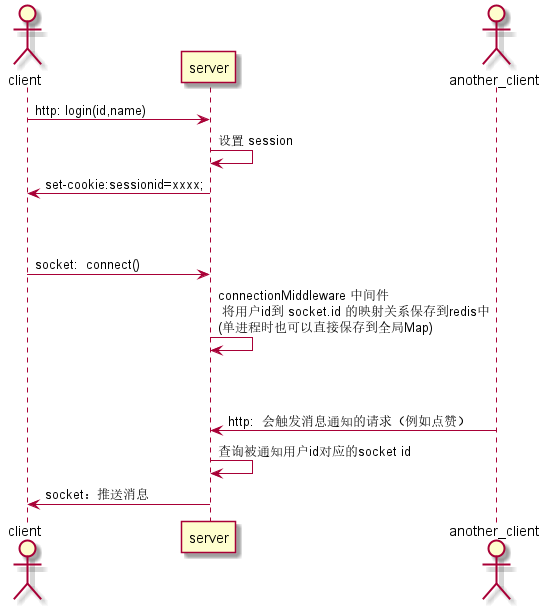
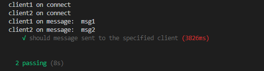

## egg-socket.io 功能

egg-socket.io是对socket.io的一个封装，加上了对router、controller、namespace和middleware的规约。

其中，router与controller主要用于分发和处理`socket.io`客户端的请求，但我们之所以引入`socket.io`，往往是为了获得服务端主动推送的能力，这两部分就略过了。


剩下的`namespace`和`middleware`与实现向指定客户端推送功能有关，在`egg-socket.io`里它们都是通过配置文件进行配置的

```js
// config.default.js
config.io = {
  namespace: {
    '/': {
      connectionMiddleware: [ 'auth' ], //连接处理
      packetMiddleware: [], //包处理
    },
  },
  generateId: req => { //自定义 socket.id 生成函数
    const data = qs.parse(req.url.split('?')[1]);
    return data.userId; // custom id must be unique
  },
};
```
简单介绍一下作用：

### namespace （命名空间）
就是socket.io的[命名空间](https://socket.io/docs/rooms-and-namespaces/#Namespaces)，作用相当于给客户端socket连接划分集合，同一组连接放在一个 namespace 下。

通过`namespace`服务器可以向命名空间下的全体客户端广播或向指定socketId的客户端单独发送消息。

```js
const namespace = app.io.of('/'); //获取命名空间 "/"
//namespace.sockets ：连接到该命名空间的所有客户端，形式为 {id1:socket1, id2:socket2}
//通过 socket.id 就可以向该namespace下的指定客户端发送消息
namespace.sockets[socketId].emit('message', msg); 
```


### middleware  （中间件）

####  connectionMiddleware： 连接处理中间件

对每一次 socket 连接的建立/断开进行处理
```js
// {app_root}/app/io/middleware/connection.js
module.exports = app => {
  return async (ctx, next) => {
    console.log('connection!');
    await next();
    // execute when disconnect.
    console.log('disconnection!');
  };
};
```

#### packetMiddleware ：包处理中间件

对每一次消息进行处理

```js
// {app_root}/app/io/middleware/packet.js
module.exports = app => {
  return async (ctx, next) => {
    ctx.socket.emit('res', 'packet received!');
    console.log('packet:', ctx.packet);
    await next();
  };
};
```

---


## 将消息发送到指定客户端的几种方式

向指定客户端发送消息的常见场景是： 一个用户的行为触发对另一个用户的通知。

举个例子，用户A给用户B的动态点了个赞，我们需要在已知用户B userId 的情况下向他推送被点赞的消息。

在上面对namespace的介绍中，我们已经了解了在已知`socket.id`的情形下可以用`namespace.sockets[socketId].emit('message', msg); ` 向指定客户端推送。

所以现在的问题转变成了如何根据userId获取socketId，将 `userId ->socketId -> client`这个链条补充完整。


### 1. 广播 （不可取）

通过获取namespace，可以向连接到该namespace下的全体客户端进行广播。

```js
const namespace = app.io.of('/');
namespace.emit('event', data);
```

如果在消息内容中携带接收者信息，再由客户端判断是不是发送给自己的进行相应的处理或忽略，可以变相的达到推送消息目的。

这种方式弊端非常明显：
- 广播时发送太多的无效消息
- 其他客户端即使不进行处理，仍会接收到消息，不够安全

### 2. [generateId()](https://github.com/eggjs/egg-socket.io#generateid)

`egg-socket.io`还提供了配置项`generateId`来生成自定义id，以此替换`socket.io`默认的随机id。

```js
  generateId: req => {
    //根据req生成id
    return id;
  },
```
如果能够直接在 `generateId()` 返回用户id，就不需要再纠结从userId到socketId的对应关系了。

问题又来了：怎样在 `generateId()` 函数中获取用户id？

该函数的参数 req 是node http模块的原始req对象`http.IncomingMessage`，并不能直接访问到session属性。这就要从req里面携带的其他信息着手了。

1. cookie
    - req里面附带了发起请求时的cookie，如果拿到cookie后将`egg-session`插件的流程重走一遍，便可以获取到 session 信息

2.  url中的query参数
    - 由于一般情况下客户端是在通过http登录完成后，再发起 socket.io连接的。客户端可以在发起连接时将用户信息附加在连接url后面，由服务器执行`generateId(req)`从query参数中获取

这两种方式都有各自的明显缺点：

用cookie获取session看起来不错，但重走`egg-session`的流程可能不算简单。

query里附加裸的 userId 可能会存在被伪造的安全风险，还需要加上签名防止伪造篡改，又要增加额外步骤。

具体方式为： 登录成功时返回 “用户信息+签名” 字符串，连接socket.io时带上。

除此以外，`generateId` 还有个缺点就是该函数是写在配置文件中的，配置中写这种复杂处理总归是不够。。呃，想个词（优雅）

### 3. 保存用户id和socket.id的映射关系

最后这种方式实现起来简单直观，而且对客户端透明，不需要做额外的事，直接连接就好了。

具体方法为：在客户端连接时，在连接中间件里将当前用户id与socket.id的映射关系保存到redis中（如果是单进程可以直接用全局的Map）。当需要向指定客户端推送时，根据被通知的用户id查出socketId，使用`namespace.sockets[socketId].emit('message', msg); `进行发送。


## 示例

介绍完了几种实现方式，这里我采用第三种方式 **3. 保存用户id和socket.id的映射关系** 写了一个最小化的可运行示例，完整的代码在 [https://github.com/hhgfy/demos/tree/master/node/egg-socket.io发送给指定客户端](https://github.com/hhgfy/demos/tree/master/node/egg-socket.io%E5%8F%91%E9%80%81%E7%BB%99%E6%8C%87%E5%AE%9A%E5%AE%A2%E6%88%B7%E7%AB%AF) 

该示例的执行时序如图



1. 首先发起http请求`/login` 设置用户登录信息，写入session中
```js
  // {app_root}/app/controller/home.js
  async login() {
    const { ctx } = this;
    const { id, name } = ctx.query;
    ctx.session.user = { id, name };
    ctx.body = {
      session: ctx.session,
    };
  }
```

2. 客户端获取返回的cookie并携带上执行socket.io的连接（实际使用时，在浏览器里不用主动携带cookie）

```js
// {app_root}/test/app/io/io.test.js
const res1 = await app.httpRequest().get('/login?id=100&name=aaa').expect(200);
const cookie1 = res1.headers['set-cookie'].join(';');// 获取已经设置过session的cookie
const client1 = client({ extraHeaders: { cookie: cookie1, port: basePort } });
```

3. 连接处理中间件保存userId与socketId的映射关系。完成这步之后，便可以向该用户发送消息了。
```js
// {app_root}/app/io/middleware/auth.js
module.exports = app => {
  return async (ctx, next) => {
    // connect
    if (!ctx.session.user) return;
    const key = `${ctx.enums.prefix.socketId}${ctx.session.user.id}`;
    const MAX_TTL = 24 * 60 * 60;// 最大过期时长，兜底用
    await app.redis.set(key, ctx.socket.id, 'EX', MAX_TTL);
    await next();
    await app.redis.del(key); // disconnect
  };
};
```

4. 其他客户端触发消息通知，发送给指定的已连接客户端

```js
// {app_root}/test/app/io/io.test.js
await app.httpRequest().get('/push?targetUserId=100&msg=msg1').expect(200);
```


5. 按用户id查找socketId，发出消息

```js
  // {app_root}/app/controller/home.js
  async push() {
    const { ctx, app } = this;
    const targetUserId = ctx.query.targetUserId;
    const msg = ctx.query.msg;

    const key = `${ctx.enums.prefix.socketId}${targetUserId}`;
    const socketId = await app.redis.get(key); // 获取socketId
    ctx.logger.info(key, socketId);
    if (socketId) {
      const namespace = app.io.of('/');
      namespace.sockets[socketId].emit('message', msg);
    }
    ctx.body = ctx.errCodes.success;
  }
```


执行 `npm run test`



