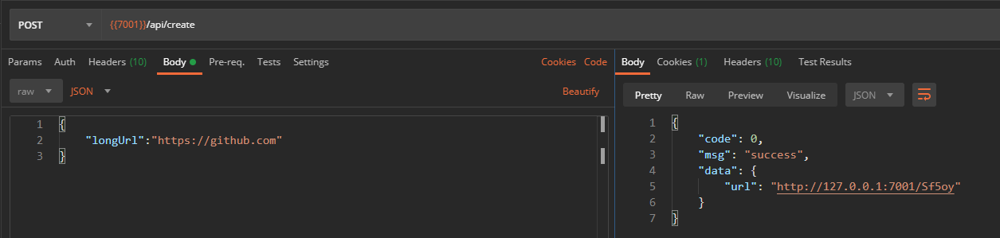

在部分存在字数限制的场景下（例如微博的140字限制和长短信拆分），如果填入很长的链接将占用可用的文本长度，需要将长链接转换为短链接。


## 一、功能分析

一个短链接服务对外仅需要暴露两个功能

1. 短链生成：提交网址，返回生成的短链接
2. 访问重定向：访问生成的短链接，能够重定向到原本的网址

此外由于短链接生成之后需要长期可用，需要使用数据库持久化存储。

下面对这两个要实现的功能进行更详细的分析

### 功能1：访问短链重定向
该功能比较简单，只需能够根据短链查询到长链接，可以是`多对一`或`一对一`的关系。

即给定一个短链，唯一确定一个长链，短链**不可重复**


---
### 功能2：长链生成短链

长链生成短链有两种生成方式：发号器和使用哈希函数


#### 1. 发号器

发号器顾名思义就是给每个将要添加的长链接分配一个编号作为短链。

最简单的做法是使用数据库的自增字段，转成62进制数来作为短链。这样实现起来确实非常简单，但也有以下的问题：

1. 数据冗余

对每个新添加的长链接，都分配一个新的编号，如果出现重复的长链将产生多个不同短链，导致数据冗余。

这问题看起来很好解决：添加时先判断长链接是否已经存在，存在则直接返回已有的，否则让发号器分配新的。但实际实现却棘手的多。

首先，要判断长链接是否已经存在，得先查一查长链接，这就势必要给长链接的列建立索引。而长链接由于是用户输入，可能会相当长。

根据 [MySQL文档](https://dev.mysql.com/doc/refman/8.0/en/innodb-limits.html)中的描述，不同行格式下最大索引长度为767或3072字节，可能会放不下长链接。即使退一步说，我们人为将允许的链接长度限制到最大索引长度以下，过长的索引列也会导致搜索效率的下降。

这么说来，直接在长链接的列上建索引不可行，还有什么方法查询长链接是否存在？

可以单独新建一个列存储长链接的哈希值，并在此列建立索引。查询时遇到相同的哈希值再去比较长链的值，确认是否是重复。不重复则新增一条记录。


2. 自增带来的安全风险

自增数即使转了62进制，仍可能被别人看出来是自增的。可以通过定时生成短链来计算该时间段的增量，进而统计整个系统的使用量

一个可行的优化方式是：采用趋势递增并不连续的发号器。可以参考 [Leaf——美团点评分布式ID生成系统](https://tech.meituan.com/2017/04/21/mt-leaf.html)

但是这种发号器本身的实现难度就已经比短链接系统更高了。


---
#### 2. 使用哈希函数
长链生成短链实际上做的事情实际上和哈希表一样，就是将无限可能的字符串（长链接）映射到有限的字符组合（短链接）。

所以一个简单的实现方式就是由 `hash(longUrl)` 来作为短链。

但这样也不可避免的遇上哈希函数固有的哈希冲突问题，即多个不同的长链接可能生成相同的短链，与我们一个短链只跳转到一个固定长链的需求相违背。

哈希冲突的问题该如何解决？让我们想想它还在哪里出现过，没错，就是**散列表**，这是一个非常典型的哈希冲突场景。

接下来可以试一试能否从散列表的实现方式中借鉴到解决哈希冲突的思路：

在散列表的实现中，往往采用如下两种方式解决哈希冲突：**链表法** 和 **开放地址法**

1. 链表法

先看看链表法解决冲突的方式。

在散列表中，多个key进行hash后，指向数组的同一个位置， 在数组的该位置用一个链表挂载这些key就能够解决哈希冲突问题。


再来尝试链表法在短链接系统中能否行得通。

做个类比，在短链接系统中，多个longUrl（对应散列表中的key）进行hash后，对应同一个短链，然后在数据库的同一行中保存多个长链。。。

等等，是不是有哪里不对？一个短链如果对应多个长链的话，访问时怎么知道该重定向到那个长链接去呢？

总结：链表法 **PASS**

2. 开放地址法

对使用开放地址法的散列表，如果碰到哈希冲突，也就是数组中对应位置的 “坑” 已经被占了。那么它会使用一个规则（线性探测、平方探测等）去探测下一个坑，如果也被占了就继续探测，直到找到一个空的“坑”，再填进去。

同样，对应到短链接系统，遇到哈希冲突，可以根据一定的规则生成新的短链接值，再次尝试插入数据库。这样看来是可行的。

再看看开地址法的性能表现，现实中散列表实现为什么多采用链表法而不是开放地址法？

这往往是因为散列表容量有限，当负载因子升高到一定程度后，开地址法将出现大量“坑”被占用，再反复探测的现象，带来高额开销。


而在短链接系统的场景中，如果将该系统看成是一个散列表的话，容量将是一个天文数字（取决于短链长度），负载因子并不会升到很高的程度，偶尔执行再探测也是完全可以接受的。

总结：开放地址法 **可行**


---

## 二、设计

综合考虑实现复杂程度、安全性、数据是否冗余等因素后，我选择使用hash函数的方式实现短链接系统。

### API 设计

1. 生成短链接
    - path:`/api/create`
    - method:`POST`
    - 请求参数
    ```js
    {
        "longUrl":"https://github.com"
    }
    ```
    - 响应
    ```js
    {
        "code":0,
        "data":{
            "url":"http://127.0.0.1:7001/Sf5oy"
        }
    }
    ```

2. 访问短链接重定向
    - path:`/短链内容`
    - method:`GET`
    - 响应： 302重定向

### 数据表设计
这里仅实现基本功能，只需一张表保存短链接和长链接的映射关系，结构如下

模型定义见 `${approot}/app/model/url.js`

```sql
CREATE TABLE `url` (
  `shortUrl` varchar(255) NOT NULL COMMENT '短链',
  `longUrl` varchar(2100) NOT NULL COMMENT '原链接',
  `visit` int NOT NULL DEFAULT '0' COMMENT '访问次数',
  `createdAt` datetime DEFAULT NULL COMMENT '创建时间',
  `updatedAt` datetime DEFAULT NULL COMMENT '更新时间',
  PRIMARY KEY (`shortUrl`)
) ENGINE=InnoDB DEFAULT CHARSET=utf8mb4 COLLATE=utf8mb4_0900_ai_ci COMMENT='url映射表';
```

- 不使用自增主键的原因？

考虑到短链必须是唯一的，并且它也是查询条件，需要在该列建立唯一索引。

再进一步考虑，短链接系统是典型的读多写少的场景，可以直接用短链接来作为主键，避免它作为二级索引还需要回表才能查到长链接。

> todo：（主键索引叶子节点保存了更多信息，会不会比二级索引更容易页分裂？不了解，再查资料）


## 三、代码实现

完整的实现代码在这里：  [https://github.com/hhgfy/demos/tree/master/node/shortUrl](https://github.com/hhgfy/demos/tree/master/node/shortUrl)

### 访问短链重定向

该功能非常简单，service里查询短链接对应的长链接，然后在controller中重定向就可以了

```js
  //${approot}/app/service/url.js
  /**
   * 根据短链查询
   * @param {*} shortUrl
   * @return {string|null}
   */
  async find(shortUrl) {
    const { ctx } = this;
    const res = await ctx.model.Url.findOne({
      attributes: [ 'shortUrl', 'longUrl' ],
      where: {
        shortUrl,
      },
    });
    return res ? res.longUrl : null;
  }
```

### 长链生成短链

该功能稍稍复杂一些， 使用`_gen(longUrl, shortUrl)`生成短链接

当短链出现唯一键冲突时，判断长链是否相同，相同则直接返回已有短链。

否则，重新使用hash算法生成新的短链值，递归执行`_gen()`，由于哈希冲突概率很低，不太可能出现多级递归的情形。

> PS: 用唯一键冲突的异常来处理逻辑，实现方式不太好

```js
  // ${approot}/app/service/url.js
  /**
   * 生成
   * @param {*} longUrl
   * @return {string} 生成的短链
   */
  async create(longUrl) {
    const shortUrl = this._hash(longUrl);
    return await this._gen(longUrl, shortUrl);
  }

  /**
   * 插入数据
   * @param {*} longUrl
   * @param {*} shortUrl
   */
  async _gen(longUrl, shortUrl) {
    const { ctx } = this;
    try {
      await ctx.model.Url.create({
        shortUrl,
        longUrl,
      });
      ctx.logger.info(`生成短链接\n${longUrl}\n${shortUrl}`);
    } catch (error) { // TODO : 不用异常来进行逻辑处理
      if (error.name === 'SequelizeUniqueConstraintError') {
        const item = await ctx.model.Url.findOne({
          attributes: [ 'shortUrl' ],
          where: {
            shortUrl,
            longUrl,
          },
        });
        if (!item) { // 发生hash冲突
          this.logger.warn('hash冲突');
          // 分配一个新的短链，类似开地址法的线性探测
          const newShortUrl = this._hash(shortUrl);
          return this._gen(longUrl, newShortUrl);
        }
        // 该长链已经生成过短链，返回已有的 shortUrl
        ctx.logger.info(`重复生成短链接\n${longUrl}\n${shortUrl}`);
      } else {
        ctx.logger.error(error);
        ctx.throw('生成异常', error);
      }
    }
    return shortUrl;
  }
```

### 效果





### 扩展和优化

除上面的基本功能外，还可以做一些扩展功能

- 按最后访问时间清理不用的url（只保证短链接在一段时间内有效）
- 访问统计
- 接口防刷


## 参考

- [短网址(short URL)系统的原理及其实现](https://hufangyun.com/2017/short-url/)
- [高性能短链接系统怎么设计？](https://mp.weixin.qq.com/s?src=11&timestamp=1596261729&ver=2495&signature=l7jRjsJ3Q1kjSX0-ng2aY-ZM6eRl9e1q*U10d9ayIhSv2JWQWKv*miG0Rawb0hnrLZo6oigAV3lc6rIsmkfrAs6WrfiZ8czXRn3pVe30Qr317tXcpat2q9mHwoLnDNDD&new=1)