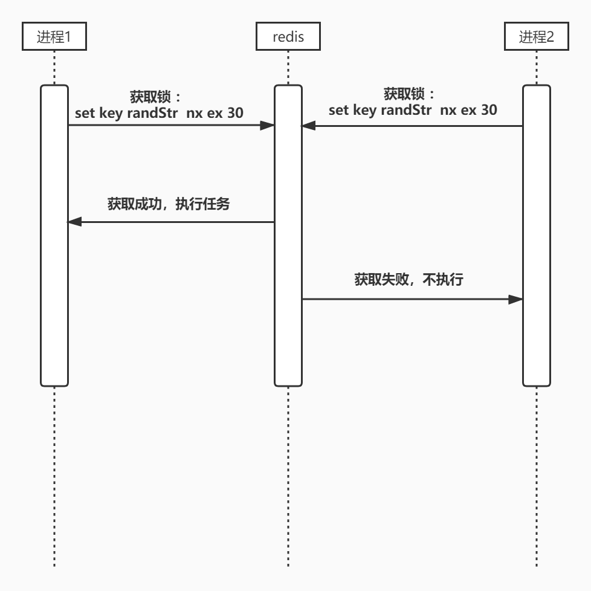
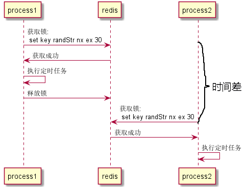

在业务开发中，定时任务是个很常见的需求，但是当服务器进行水平扩展，部署多个节点之后，分散在多个节点的任务将被重复执行。

如果是定时压缩日志之类的幂等操作的话还好，并不会产生额外的后果。但如果执行的是非幂等操作，例如发送消息通知，导致重复通知就不是我们想看到的了。

所以对于执行非幂等操作的定时任务，需要提供保证只能执行一次的机制，可以使用基于Redis的分布式锁来实现该机制。

## 实现

[示例](https://github.com/hhgfy/demos/tree/master/node/%E5%88%86%E5%B8%83%E5%BC%8F%E9%94%81%E9%81%BF%E5%85%8D%E5%AE%9A%E6%97%B6%E4%BB%BB%E5%8A%A1%E9%87%8D%E5%A4%8D)

```js
//   ${root}/app/schedule/mySchedule.js
  async subscribe() {
    const { app } = this;
    const lockKey = app.config.lock.key;
    // const MIN_TTL = 5;
    const MAX_TTL = 30;
    const value = Math.random();
    const res = await this.app.redis.set(lockKey, value, 'ex', MAX_TTL, 'nx');
    if (res === 'OK') {
      this.logger.info(`进程${process.pid} 获取锁`);
      await this.doSomething(); //执行所需的定时任务
      //   await sleep(MIN_TTL); //保证持有锁时长的下限
      // 释放锁
      await this.app.redis.unlock(lockKey, value);
    } else {
      this.logger.info(`进程${process.pid} 未获取锁`);
    }
  }
```

`redis.unlock()`是ioredis提供的使用lua脚本来自定义命令，这里定义了`unlock `用来执行原子的 **比较&删除** 来释放锁

```js
  //${root}/app.js 

  //插件启动完毕
  async willReady() {
    //ioredis 自定义命令
    this.app.redis.defineCommand('unlock', {
      numberOfKeys: 1,
      lua: `
      if redis.call("get",KEYS[1]) == ARGV[1] then
        return redis.call("del",KEYS[1])
      else
        return 0
      end`,
    });
  }

```


## 踩坑

这么简单就结束了吗？当然没有，下面说一下碰到过的一个坑。

在理想情况下，定时器设置的时间一到，各个节点发送获取锁的请求给Redis服务。

其中一个节点获取锁，并开始执行定时任务。其他节点获取失败，放弃执行。如图：




但是站在redis服务器的角度看，每个节点的请求却并不一定是一起到达的。

由于可能存在网络的不可靠导致的延迟和服务器之间时钟不同步的时差（一定要确认下服务器配好了NTP！！），会导致各客户端本该同时到达的获取锁请求在到达Redis时出现了时间差。

如果再不凑巧，这个定时任务执行的很快，比如发个http请求之类的，仅需几十毫秒。

发完了就直接释放了锁，这时又一个节点的请求才姗姗来迟，再次获取了锁，便可能导致定时任务重复执行。



本来，Redis的分布式锁需要通过`expire`参数设置一个持有时间的上限，超过时间自动释放锁。

在现在这种情况下，我们不仅需要持有时间的上限，还需要规定一个时间的下限，该下限需要能够覆盖可能的时间差。

一个简单的方法是定时任务执行完了，sleep()一下之后再去释放锁。即上面代码中被注释的 ` //   await sleep(MIN_TTL);`

或者干脆不执行主动释放，让这个键自己到时过期。
