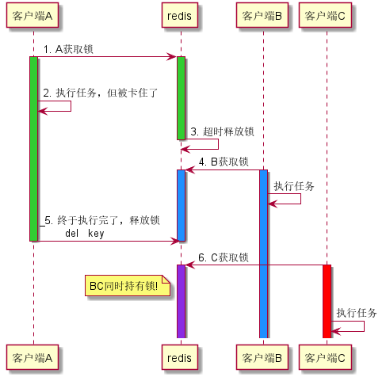
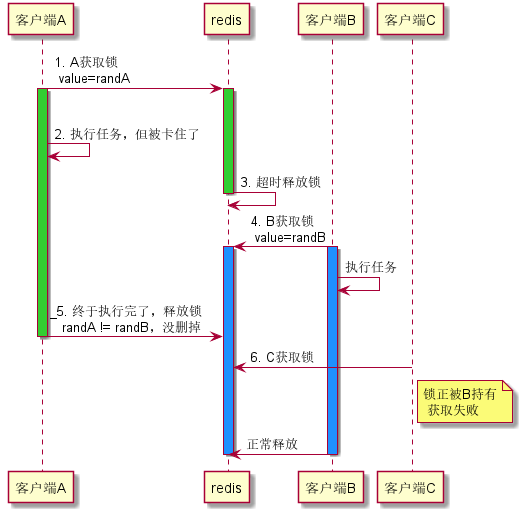
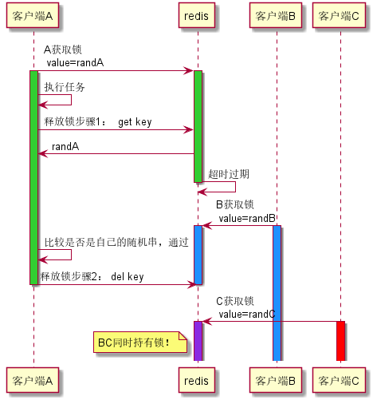
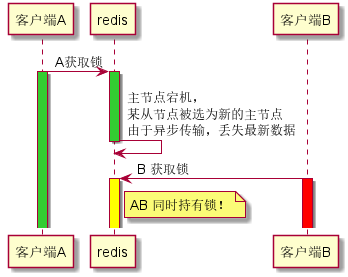

本文重点并不在于提供一个可运行的Redis分布式锁示例，而是结合图文理解redis的分布式锁实现上的细节，以及为什么要这样做。


## 实现方式

用伪代码的形式简单介绍实现方式

### 获取锁

```
SET resource_name my_random_value NX EX 30
```
- my_random_value: 一个随机值，同一key的竞争者这个值都不能一样
- NX : 只在键不存在时， 才对键进行设置操作
- EX : 设置过期秒数

### 释放锁

通过lua脚本实现原子的 **比较 & 删除**

```lua
if redis.call("get",KEYS[1]) == ARGV[1] then
    return redis.call("del",KEYS[1])
else
    return 0
end
```

### 伪代码

```js
let randStr = Math.random();
let success = redis.set(key, randStr, 'EX', 30, 'NX');
if(success){
    // 获取到锁

    doSomething(); //执行要做的任务
    
    //执行完释放锁
    redis.call(`
    if redis.call("get",KEYS[1]) == ARGV[1] then
        return redis.call("del",KEYS[1])
    else
        return 0
    end`,key,randStr);
}else{
    //未获取到锁
}

```

这样看起来，Redis实现分布式锁用起来很简单嘛。

但是，为啥这样写？

- [设置随机值是做什么的？为什么释放时要先比较随机值相同再删除？](#设置随机值是做什么的？为什么释放时要先比较随机值相同再删除？)
- [为什么“比较&删除”需要用到lua脚本实现原子操作？](#为什么“比较&删除”需要用到lua脚本实现原子操作？)
- [单redis节点实现真的够保险了吗？](#单redis节点实现真的够保险了吗？)


---

## 几个问题

### 设置随机值是做什么的？为什么释放时要先比较随机值相同再删除？


先回答后一个问题，释放锁之前为什么要先判断值相等呢，为什么不直接一句`del key`多方便啊。

首先要知道，分布式锁一个最基本的功能就是实现互斥，同一个时刻，应当只有一个客户端能够持有锁。

如果直接`del key`,则可能会出现下面的情况

1. 客户端A获取锁，执行任务 （Redis客户端，实际是一个服务器节点）
2. A执行中被阻塞，卡住了
3. 锁超时自动释放了，但A仍在继续执行
4. 客户端B获取锁，开始执行它自己的任务
5. A缓过来了，任务完成执行，然后一句`del key` 将B当前正在持有的锁释放了 （但B此时不知情，还以为自己持有锁，继续执行自己的任务）
6. 另有客户端C获取锁，这时客户端B和C同时持有，不满足互斥性了

（激活生命线表示有客户端持有锁，按颜色对应）




再来看看使用随机值是怎么避免这一问题的。

首先，客户端获取锁的时候，设置的value为各个客户端自己生成的随机字符串。

在步骤5，由于客户端A和B的随机值不一样，只会走lua脚本里的else分支，而不进行删除，这样客户端C自然也就没有了可乘之机。

总的来说，随机字符串是用作每个客户端的“标识”，来确保客户端只能删除自己获取的锁，而不会误删其他客户端的。

使用了随机字符串后的时序图



看到这，你也许会想：不对呀，客户端B和C存在重叠的部分（图1中红蓝），表示同时持有锁了。但AB也有重叠部分啊（图1中蓝绿），这是不是有bug？

对不起，这还真不算bug，只能算是 **feature**。


因为要防止客户端崩溃而导致锁永不释放，锁的过期时间是不得不加的。

所以，这里只能根据获取锁后要执行的任务内容，来设置一个合适的锁过期时间。

或者采用部分语言中客户端的方式，在过期前延长过期时间。

---
### 为什么释放锁的“比较&删除”需要用到lua脚本实现原子操作？

上面的例子中释放锁时用了这么一个lua脚本
```lua
if redis.call("get",KEYS[1]) == ARGV[1] then
    return redis.call("del",KEYS[1])
else
    return 0
end
```

为什么不直接在代码里写呢？

```js
let value = redis.get(key);
if(randStr == value){
    redis.del(key);
}
```


不多废话，直接上图



图中可以看出，如果不使用lua脚本将“比较&删除”这两步合在一起形成原子操作，那么读取和删除这两个步骤之间可能会出现原有锁过期，又被另一个客户端B获取的情况。

而原客户端A不知情，仍然执行了删除，删掉了客户端B正常获取的锁，最终导致BC同时持有，不满足互斥性。

---
### 单redis节点实现真的够保险了吗？

单个redis节点实现的分布式锁虽然一般来说够用了，但记住它并非完全可靠。

前面的场景中都假设了Redis服务能够正常运行，但如果发生了主节点的切换，由从节点顶上，仍可能导致多客户端都认为自己持有锁的情况。





这个场景比较简单：
1. 客户端A获取锁
2. redis主节点宕机，但设锁对应的键还没来得及同步到从节点上
3. 从节点被选为新的主节点，丢失了键
4. 另有客户端B获取锁，AB同时认为自己持有锁


所以如果需要避免单个redis节点崩溃切换后丢数据的问题，实现更高级别的保障，可以用多个redis节点实现的 [redlock](https://redis.io/topics/distlock#the-redlock-algorithm)

> 注意：即使是redlock，仍不能100%保证可靠，只是比单个redis更安全一些。


---
## 参考
> https://redis.io/topics/distlock


