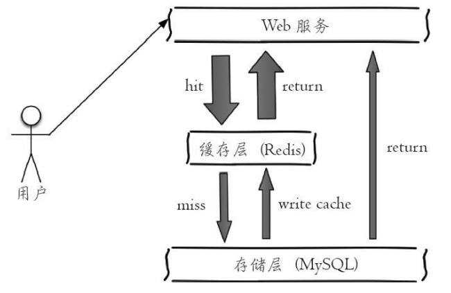
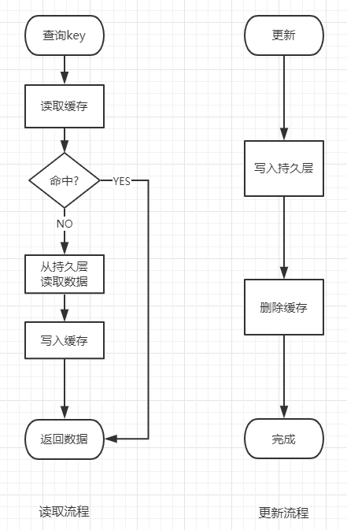
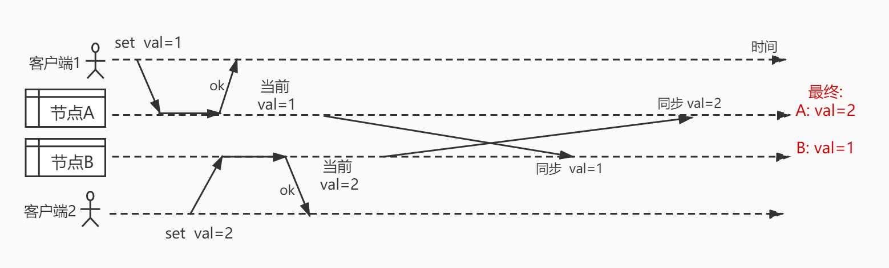
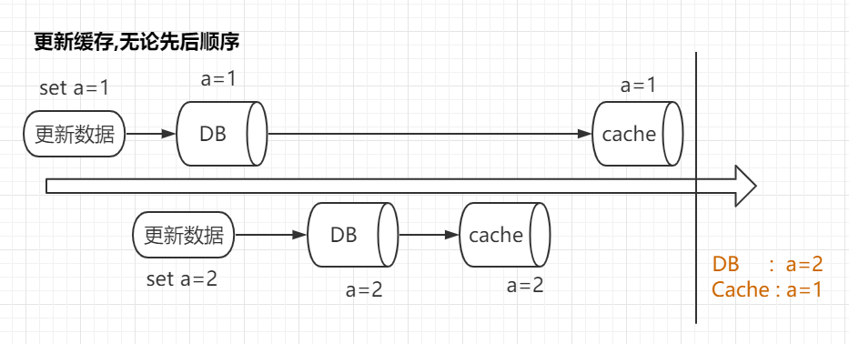
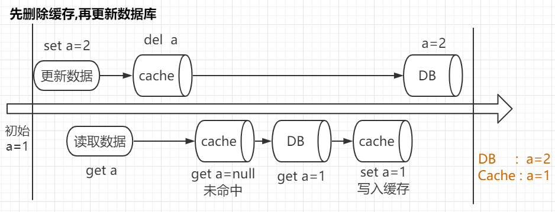
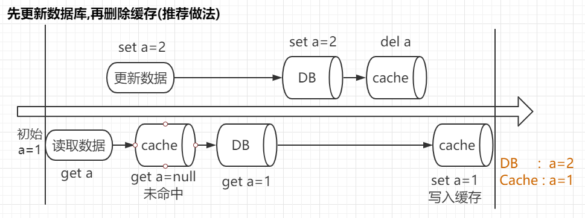
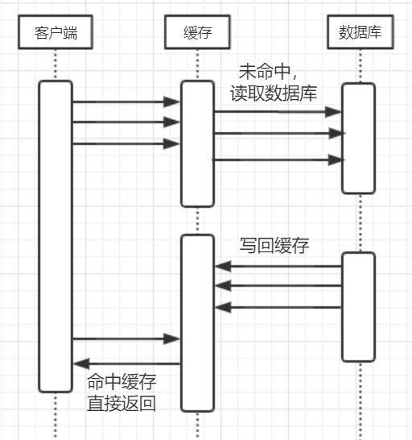

Redis作为一个高性能的内存存储系统，一个典型的应用场景就是作为缓存来使用，用于降低数据库压力。如图所示:

## Redis作为缓存的使用方式

使用缓存分为读取和更新两步

### 读取

1. 读取redis中对应的key
2. 有缓存直接返回，否则读取数据库
3. 数据库读出后写入redis，并返回数据

### 更新

1. 更新数据库
2. 删除redis对应key

上述两个步骤的流程图如下:

---  

## 缓存作用和优缺点

### 优点
1. 读取速度: 缓存最直接的作用就是可以加快读取速度,存在于内存中的缓存读取速度要远高于磁盘

2. 降低数据库压力: 数据库能承受的并发量往往比较有限,使用缓存命中后直接返回有助于降低SQL语句执行次数

### 缺点
1. 数据不一致: 由于缓存更新策略的原因,无法保证数据库和缓存中的数据一致性

2. 代码中需要对缓存进行额外处理

---

## 使用Redis作为缓存的优点

从前面的缓存使用方式可以看出,只要可以做到比数据库更快的访问速度,实现`get(key)`,`set(key,value)`,`del(key)`这几个抽象的方法就可以被当成缓存使用。比如哈希表就可以作为一个简单的缓存来进行使用;

那么,为什么Redis被普遍的用作缓存,它相比于直接使用内存变量有哪些优点呢?

### 优点1. 有利于水平扩展

现在的后端程序往往是需要多个节点进行负载均衡对外提供服务的，而进程内缓存只有本节点能够访问

在这种场景下，如果使用了进程内缓存，那么也就意味着每个节点有它自己的"状态"，导致在A节点更改了缓存数据，而B节点缓存数据并不会发生变更，这时再从B节点读取就会得到没有更改过的旧数据，与A节点不一致，而使用Redis保证只有一份缓存数据可以很好的避免这些问题

这种不一致有如下解决方式:

#### 方式1: 同步数据

当在某个节点中更新缓存时，将数据变化同步到全部其他节点

但是这样会造成以下问题:

1. 同样的数据在每一个节点都有一份拷贝，浪费内存

2. 同步的延迟不确定，可能在修改后的一段时间内没有完成同步，读到旧数据

3. 同步的数据量大，网络开销多;随着节点数`N`的增长，因为要同步到每一个其他节点，发送`N-1`份数据，难以接受

4. 由于这种方式相当于有多个可写的主节点，同步时会导致数据的不一致(如图)
    

#### 方式2:　黏性会话
多节点写入导致的数据不一致问题可以通过将对同一个键的写操作都发到同一个节点执行来避免，但这样也就需要负载均衡服务需要额外的分发逻辑进行处理

### 优点2. Redis更可靠
Redis提供了键定时过期，内存淘汰等功能，支持多种淘汰策略;并且经过多年大规模的使用，可靠性很高 

---
## 数据更新时,删除缓存的原因

上文中的缓存更新方式写到 “数据写入数据库,完成后使用del命令删除Redis中对应键的缓存”，为什么选择这种而不是采用先删除缓存再更新数据库，或者直接更新缓存的方式呢？

下面分析这几种方式各自的缺点在哪里：

\\|先数据库 |	先缓存
---|---|---
更新缓存	|① set DB  set cache |	②set cache  set DB
删除缓存 |	③set DB   del cache |	④del cache  set DB

### ①和② 更新缓存
无论数据库和缓存的操作顺序，只要对缓存更新就有可能发生如下图的情况：

以先更新数据库，再更新缓存为例，考虑有两个并发的写请求，一个将键`a`的值设置为1，另一个设置为2，由于两个写请求的处理顺序不确定，可能出现下图中的情况，导致最终缓存和数据库不一致。

同理，将缓存和数据库的操作顺序换过来也会出现一样的情况

### ④先删除缓存，再更新数据库
对于先删除缓存的情况，考虑存在并发的读和写请求，写请求先将a对应的缓存删除，这时发生读取会导致无法命中缓存，将会从数据库中读出旧的数据写回缓存中，最后写请求将新的数据写入，导致不一致。如图：

### ③先更新数据库，再删除缓存 
最后就是实际推荐的更新方式，但它并非不会出现问题，与上一种情况类似，在一读一写的情形下，也有可能发生数据的不一致。

但是这种方式的优点在于，一般来说写数据库的执行速度远慢于写入缓存，如果要发生这种情况，意味着写入缓存的时间比更新数据和删除缓存这两步加起来还要慢，出现这个问题的概率在这四种更新方式中是最低的。

---
## 使用缓存可能导致的问题及处理方法

### 问题1：数据不一致
通过上面的缓存数据更新的几种方式，我们了解到无论采用那一种方法，都无法避免数据不一致的可能，只能尽量选择出问题概率最小的方式。但是一旦出现不一致，在不进行重新更新的情况下，脏数据将会一直保留下来。

为此，可以通过给缓存设置一个 **过期时间** 来避免脏数据一直保留，在过期后重新获取最新的正确数据

### 问题2： 缓存穿透
当出现代码异常、爬虫遍历或者拒绝服务攻击时，可能出现大量访问缓存中不存在数据的请求。这时，不存在缓存命中，所有请求都发到数据库上，引起缓存穿透的问题。

有以下的解决方法：

#### 1. 缓存空值

将 **不存在** 作为一个特殊的值缓存下来，命中后作为一个正常的值返回，可以避免数据库查询。

但是这种方法缺点在于，缓存空值也会占用内存，所以空值应设置一个较短的过期时间，避免占用过多

#### 2. 使用布隆过滤器
使用布隆过滤器可以让所有存在的数据以及少量的不存在数据通过，可以有效的避免缓存穿透问题

缺点在于：布隆过滤器只能添加和查询是否存在，不能进行删除，已经删除的数据也会被放行，可以通过定期重建来避免

### 问题3：缓存击穿
为了解决数据不一致的问题，上面给出了设置过期时间这个办法。但是由于这个过期时间，又引入了新的问题。

对于需要被高频访问的热点数据（比如明星的微博），不断的有许多读请求，正常情况下，这些请求命中缓存直接返回，不会产生什么影响。但是当缓存过期时，需要重新从数据库中读取数据写回缓存，在写回缓存之前的一段时间里，所有请求都会发到数据库上，引起一瞬间的负载过高

解决方法：

#### 1. 互斥锁
使用互斥锁，同一时间只有一个线程去读取数据库，其他未获取锁的进行重试，直到数据写回缓存

#### 2. 不设置过期时间
对热点数据不设置过期时间，而是采用定时更新缓存等其他方式保证一致性

---
## 缓存适用场景
综上所述，使用缓存可以有效降低数据库压力，提高系统的吞吐量，但也会带来一段时间内的数据不一致等问题。总体来说适用于读多写少、高吞吐量、能够转化为键值对格式、一定程度上容忍不一致的的场景。

以下场景需要慎用：

1. 访问量低，数据库完全可以承受，不需要弄的这么复杂
2. 数据一致性要求严格，比如涉及到资金的情形
3. 读得少写得多，体现不出来缓存的优势，反而需要很多额外的删除缓存操作

