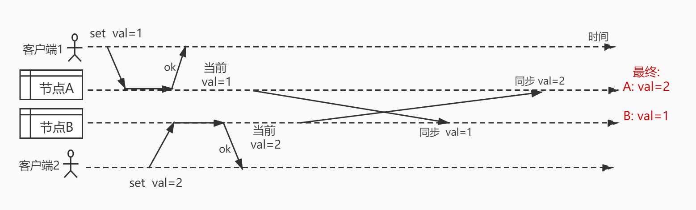

在后端系统中，由于数据库读写性能所限，性能瓶颈往往出现在数据库上，为了降低数据库访问压力，可以采取的方式有缓存、数据库读写分离、分表等

其中，对于数据库读取压力过大的情况，缓存可以说是首选解决方式

缓存按照数据存储位置来区分，缓存可以分为两种: 进程内缓存与进程外缓存

- 进程内缓存: 最简单的可以直接用语言内的散列表(Java HashMap，Python字典 等)，或者一些功能更完善的第三方库

- 进程外缓存: 常见的如Redis，Memcache等

下面的表格是两者之间一些优缺点的对比， 下文将逐条分析这些优缺点

/|进程内缓存|Redis
---|---|---
水平扩展 | 困难	| 简单
可靠/易用 | 没有过期，内存淘汰等 | 可靠
访问速度 |	直接操作变量，延迟低 |	需要网络传输和序列化
能否保存引用类型  |	可以保存引用类型 |	只能存字符串

---

# 进程内缓存缺点

## 缺点1. 不利于水平扩展

现在的后端程序往往是需要多个节点进行负载均衡对外提供服务的，而进程内缓存只有本节点能够访问

在这种场景下，如果使用了进程内缓存，那么也就意味着每个节点有它自己的"状态"，导致在A节点更改了缓存，而B节点缓存数据并不会发生变更，这时再从B节点读取就会得到没有更改过的旧数据，与A节点不一致

这种不一致有如下解决方式:

####  方式1: 同步数据
- 方式: 当在某个节点中更新缓存时，将数据变化同步到全部其他节点
- 缺点: 
    1. 同样的数据在每一个节点都有一份拷贝，浪费内存
    2. 同步的延迟不确定，可能在修改后的一段时间内没有完成同步，读到旧数据
    3. 同步的数据量大，网络开销多;随着节点数`N`的增长，因为要同步到每一个其他节点，发送`N-1`份数据，难以接受
    4. 由于这种方式相当于有多个可写的主节点，同步时会导致数据 **不一致** (先更改的值可能覆盖后更改的) 如下图所示:
    

#### 方式2: 黏性session: 

在上面列出的几个缺点中，多节点写入导致的数据不一致问题是最严重的

面对这种问题，可以通过将对同一个键的写操作都发到同一个节点来避免

- 方式: 在负载均衡时发到指定的节点
- 缺点: 负载均衡服务需要处理额外的逻辑，实现复杂

## 缺点2. 可靠性不高，功能不全

Redis提供了键过期，定时清理，内存淘汰等功能，支持多种淘汰策略;并且经过多年大规模的使用，可靠性很高

进程内缓存的另一个问题就是比较简陋，往往不具备这些功能，可能需要自己处理内存溢出等情况，无疑比较困难

---

# 进程内缓存优点

## 优点1. 访问速度更快
由于客户端和Redis之间需要等待网络通信的延迟，并且对数据要做额外的序列化和反序列化处理，所以访问速度自然低于直接访问内存变量的进程内缓存

## 优点2. 可以保存引用类型
进程内缓存的另一个优点就是可以保存引用类型，而Redis实际上只能存字符串，这在某些场景中是非常有用的

例如: 缓存定时任务的对象

业务中常常需要让一个任务在某个时间点执行，并可能在执行之前进行取消;
这时候使用进程内缓存保存定时任务的对象就可以很方便的执行对象上的取消定时任务方法了，而使用Redis则难以做到这一点

# 总结 
Redis之类的进程外缓存功能比较完善，一般情况下直接使用它即可

但是进程内缓存在某些场景中也很有用处，例如:
1. 数据相对固定: 对于不怎么变化的数据，不在意更新数据导致的一致性问题， 使用进程内缓存可以获取更快的访问速度，避免网络和序列化开销
2. 需要缓存引用类型
