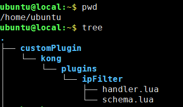

在开发kong自定义插件时，可能会面对需要多个worker共享一些信息或者接收外部的程序输入的情况。而多进程共享信息常用的方式就是redis。

kong里面已经包含了[lua-resty-redis](https://github.com/openresty/lua-resty-redis) 这个redis连接库，在插件代码中直接 `require "resty.redis"`就可以使用了

## 一些要注意的点

### 连接池
由于kong的插件开启后，对于指定的Route/Service，每个请求都将执行一遍。如果每次都去重新连接redis，效率会很低。

lua-resty-redis提供了`pool_size`选项来使用redis连接池。

当在插件代码中使用redis后，需要执行`close`关闭连接，或者使用`set_keepalive` 将当前连接放入连接池中，供下一次使用。

- `set_keepalive`方法签名： `set_keepalive(max_idle_timeout, pool_size)`
    - `max_idle_timeout` 表示超时断开时间
    - `pool_size` 表示连接池大小


奇怪的是在`connect`的选项中也有一个连接池，看到 [issue](https://github.com/openresty/lua-resty-redis/issues/177) 中的解释是优先使用`connect`中的连接池大小，没有设置则用 `set_keepalive` 中的


### redis 认证

与常见的redis客户端在连接时将密码和ip端口等参数一起传进构造函数的的方式不同，`lua-resty-redis`是连接后再执行 `auth` 命令的

```lua
local redis = require "resty.redis"
local red = redis:new()

red:set_timeouts(1000, 1000, 1000) -- 1 sec

local ok, err = red:connect("127.0.0.1", 6379)
if not ok then
    ngx.say("failed to connect: ", err)
    return
end

local res, err = red:auth("foobared")
if not res then
    ngx.say("failed to authenticate: ", err)
    return
end
```

### [使用限制](https://github.com/openresty/lua-resty-redis#Limitations)

- 执行阶段限制：resty.redis 不能在 `init_by_lua*, set_by_lua*, log_by_lua*, and header_filter_by_lua*` 这些阶段执行。对应到kong，就是`init_worker() header_filter()  log()` 等函数里不可用使用该redis客户端

- resty.redis 的实例不能作为模块级别的变量使用，需要将它作为一个函数级的局部变量。所以下面的示例中，我是在access函数内去执行 `require "resty.redis"`的


---
## 基于redis的ip黑名单插件示例

> [示例代码](https://github.com/hhgfy/demos/tree/master/kong/plugin_redis/ipFilter)

开头说到了在多个worker共享一些信息或者接收外部的程序输入时，可以使用redis来实现。

举个例子，假设存在一个判断ip黑名单的服务，它会动态的修改ip黑名单列表，然后需要在kong网关对黑名单进行统一拦截。

这种情况下，要用插件配置来做就不太现实了，而使用redis便可以很方便的实现该功能。

只需要两步：
1. 黑名单服务对redis写入 `前缀:ip` 形式的键，可以灵活的控制黑名单生效时长
2. kong插件在接到请求时判断是否存在 `前缀:ip` 形式的键，匹配上了直接返回403

### 目录结构


### 插件代码
- handler.lua

在access阶段，获取客户端ip，从redis查询是否存在键 `ip:${ip}`，查到了就直接在插件返回403响应，不再发送到上游的服务中。

```lua
local IpFilterHandler = {}

function IpFilterHandler:access(plugin_conf)

    local redisHost = plugin_conf.redisHost
    local redisPort = plugin_conf.redisPort
    local redisPass = plugin_conf.redisPass

    local ipPrefix = "ip:"
    local clientIp = kong.client.get_ip();
    local redis = require "resty.redis"
    local red = redis:new()
    red:set_timeouts(1000, 1000, 1000) -- 1 sec

    local ok, err = red:connect(redisHost, redisPort)
    if not ok then
        kong.log.warn("failed to connect redis: ", err)
    else
        if(redisPass ~= "")
        then
            local auth, err = red:auth(redisPass)
            if not auth then
                kong.log.warn("failed to authenticate: ", err)
            end
        end
    
        local ipRes, err = red:get(ipPrefix..clientIp)
        if ipRes ~= ngx.null then
            kong.log.err("IP "..clientIp.. "  access denied")
            kong.response.exit(403, "IP "..clientIp .." forbidden access")
            return
        end
        -- 使用连接池
        local ok, err = red:set_keepalive(10000, 100) -- (超时时间 ms, 连接池大小)
    end
end

return IpFilterHandler

```
---
- schema.lua

需要连接的redis配置

```lua
return {
  no_consumer = false, 
  fields = {
    redisPass = {type = "string", required = true,default = ""},
    redisHost = {type = "string", required = true},
    redisPort = {type = "string", required = true}
  }
}
```

### 插件添加方式

- 修改kong配置文件 `/etc/kong/kong.conf`

```sh
# 添加插件
plugins = bundled,ipFilter
# 添加自定义插件代码路径
lua_package_path = /home/ubuntu/customPlugin/?.lua;./?.lua;./?/init.lua;
```


### 使用

对任意的route或service开启该插件，访问正常


向redis写入黑名单 `set ip:127.0.0.1 xxx`，


再次访问，返回403


