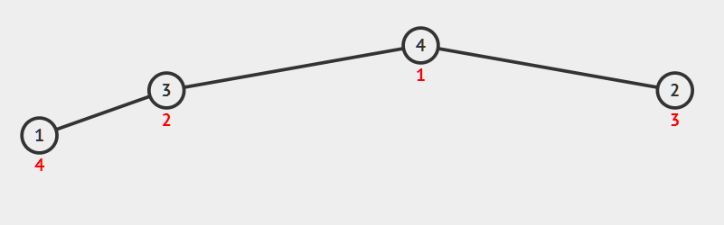
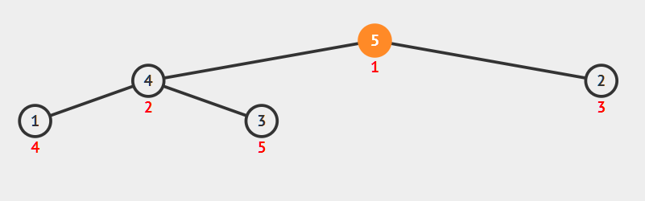

由于JavaScript缺少内置的优先队列实现（例如Java的PriorityQueue，Python的heapq），导致刷题时碰到优先队列相关的题只能换语言写，还是自己写一个吧。

完整实现代码见 [github](https://github.com/hhgfy/demos/tree/master/node/Heap)

[二叉堆可视化](https://visualgo.net/en/heap)


## 概念

### 堆

作为前置知识，首先要了解一下堆的基本概念。

堆首先是一棵完全二叉树，也就是每层从左边依次填充的二叉树，由于这个特性，使它可以方便的由数组实现。

取一个数组arr，下标为0位置废弃不用，从1开始。那么对任意的下标i来说，它的父节点和左右子节点分别为

- 父节点：`arr[i/2]`
- 左子节点：`arr[i*2]`
- 右子节点：`arr[i*2 + 1]`

可以非常方便的寻找任意节点的父子节点，在堆的实现里是非常有用的特性。

堆除了拥有完全二叉树的特点之外，还有自己独有的特性，那就是一个节点要比它的左右两个子节点有更高（或相等）的 `优先级`。

优先级取决于使用者自己的定义，例如数字越小优先级越高，那么最小的值将出现在树的根节点，也可以看做是堆的“顶”，所以被称为 **小顶堆**（也有叫法为“小根堆”）。反之，则称为**大顶堆**。

在弹出数据时，堆总是弹出当前数据集中优先级最高的元素，也就是堆顶，这个特点能够完美匹配优先队列概念。

### 堆与优先队列

普通的队列是先进先出的，而优先队列则不同，它每次都会选择优先级最高的元素出队。

优先队列是一个逻辑上的数据结构，要想实现它可以采用很多种不同的方式。例如，一个有序链表就可以作为优先队列，入队时将元素插入合适位置，出队删除链表头并返回就可以了。

那么，为什么往往优先队列和堆总是放在一起，甚至一定程度上可以画上等号？

当然还是因为堆这种实现方式最契合于优先队列，以下是几种数据结构实现优先队列的复杂度。


| 实现方式   | 入队时间复杂度  | 出队时间复杂度  | 获取优先级最高元素 | 描述                                                         |
| ---------- | --------------- | --------------- | ------------------ | ------------------------------------------------------------ |
| 无序数组   | `O(1)`          | `O(n)`          | `O(n)`             | 出队时找到最值删除并返回，找最值和删除需要遍历 `O(n)`        |
| 无序链表   | `O(1)`          | `O(n)`          | `O(n)`             | 出队时找到最值删除并返回，找最值需要遍历 `O(n)`              |
| 有序数组   | `O(n)`          | `O(1)`          | `O(1)`             | 入队时需要找合适位置 （可二分搜索`O(logn)`） ，但要移动后面的元素 `O(n)` |
| 有序链表   | `O(n)`          | `O(1)`          | `O(1)`             | 入队时需要遍历找合适位置 `O(n)`                              |
| 二叉搜索树 | `O(logn)`(平均) | `O(logn)`(平均) | `O(logn)`(平均)    | 均为 `O(logn)`                                                  |
| 二叉堆     | `O(logn)`       | `O(logn)`       | `O(1)`             | 本文详述                                                     |

---

### 优先队列ADT

要实现一个优先队列的基本功能，需要对外提供以下几个API：

```js
class Heap {
  constructor(compare) {} //构造函数，能够接受自定义的优先级比较方法
  push(item) {} // 入队
  pop() {} // 返回优先级最高元素，出队
  peek() {} // 返回优先级最高元素，但不出队
  get size() {} // 当前队列的大小
}
```

---
## 实现


### 构造函数

构造函数只需要做两件事

1. 初始化用于存储堆数据的数组
2. 接受传入的优先级比较函数，没有则使用默认实现

```js
  constructor(compare) {
    this.arr = [ 0 ]; // 下标从1开始好算，下标0废弃
    this.compare = (typeof compare === 'function') ? compare : this._defaultCompare;
  }
```

### 自定义比较函数

关于比较函数 `compare` ，要先明确它的定义。

与`Array.sort()`里的比较函数返回负数、0、正数三种状态不同，我在这里把 `compare(a,b)` 定义为 **元素a是否比b有更高的优先级，更接近堆顶**，返回bool值。即a更靠近堆顶，返回`true`，b更靠近堆顶则返回`false`。

这样写代码时可以不用纠结 `compare` 结果大于0小于0是什么含义，简化实现。

### push

首先要实现的添加元素功能，方式为：

1. 新的元素添加到整个堆的末尾
2. 尝试让它进行“上浮”，回到它应该呆的位置

上浮操作是为了维护堆中元素总是比子节点优先级更高的性质。

具体操作也就是不断的将该元素与它的父节点比较优先级，如果新元素优先更高，理应更靠近堆顶，那么交换新元素和它父节点的位置。上浮一层之后继续执行，直到不满足比父节点优先级更高这一条件或者抵达堆顶。



(图：初始化 [4,3,2,1] 的大顶堆，执行 `push(5)`，将5插入到最后面，然后尝试上浮)

> 红色数字表示它们对应的数组下标

```js
  push(item) {
    let { arr } = this;
    arr.push(item); //添加到末尾
    this._up(arr.length - 1); // 尝试上浮
  }

    /**
   * 上浮第k个元素
   * @param {int} k
   */
  _up(k) {
    let { arr, compare, _parent } = this;
    // k 比它的父节点更靠近堆顶，应该继续上浮（k=1 表示已经到达堆顶）
    while (k > 1 && compare(arr[k], arr[_parent(k)])) {
      this._swap(_parent(k), k); //_parent(k) 获取父节点下标
      k = _parent(k);
    }
  }
```

### pop & peek

然后是弹出最高优先级元素的功能，步骤为：

1. 保存当前堆顶，用于最后返回
2. 移除堆顶，将现在末尾的元素移上来填补堆顶空缺
3. 尝试对这个新堆顶进行“下沉”，回到应有位置
4. 返回保存的原堆顶元素

与push一样，pop过程也需要维持堆的性质，所以末尾元素移到堆顶后还需要尝试下沉。不过，每次下沉时，有左右两个子节点可以用来进行比较，那么该选哪个呢？

- 情况1 只有左子节点：没得选，只和该节点比较判断是否交换
- 情况2 左右子节点都有：选择左右节点之间优先级较高的进行比较

左右节点之间优先级较高元素的原因很简单，维护堆的性质。选择优先级高的比较，如果发生了交换，那么这个新的父节点优先级也会高于另一个没有参与交换的子节点，仍然能保持堆越往上优先级越高的性质。




(图：对 [5,4,3,2,1] 的大顶堆，执行 `pop()`，堆顶5弹出，将末尾的3填补上去，再将3下沉)


```js
  pop() {
    if(this.size === 0) return null; //没有返回null，行为同Java的PriorityQueue
    let { arr } = this;
    this._swap(1, arr.length - 1);// 末尾的换上来，堆顶放到最后等待返回
    let res = arr.pop(); //保存待返回元素
    this._down(1);// 换上来的末尾尝试下沉
    return res;
  }

  /**
   * 下沉第k个元素
   * @param {int} k
   */
  _down(k) {
    let { arr, compare, _left, _right } = this;
    let size = this.size;
    // 如果沉到堆底，就沉不下去了
    while (_left(k) <= size) {
      let child = _left(k); // _left(k) 、_right(k) 获取子节点下标
      if (_right(k) <= size && compare(arr[_right(k)], arr[child])) {
        child = _right(k); // 选择左右子节点中更靠近堆顶的，这样能维持下沉后原本的 left与right 之间的顺序关系
      }
      // 如果当前的k比子节点更靠近堆顶，不用下沉了
      if (compare(arr[k], arr[child])) return;
      // 继续下沉
      this._swap(k, child);
      k = child;
    }
  }
  
  /**
   * 返回堆顶元素
   */
  peek() {
    return this.arr[1];
  }
```

### heapify
至此，一个简单的堆实现就基本上完成了，但一般情况下，我们需要的可能不是生成一个空的堆，再一个个添加元素，而需要直接对一组数据进行堆化(heapify)。

为此，额外加入了一个静态方法 `heapify`，该方法接收一个可迭代对象和比较函数，返回一个填好数据的堆。（其实只是实现一个生成堆的工厂函数，并把一个个填数据的过程隐藏到内部了）

```js
  /**
   * 根据可迭代对象生成堆
   * @param {*} data iterable 对象
   * @param {*} compare
   */
  static heapify(data, compare = undefined) {
    let heap = new Heap(compare);
    for (let item of data) {
      heap.push(item);
    }
    return heap;
  }
```


---
## 使用方式和例题

### 使用方式
- `new Heap()` 
```js
let heap = new Heap((a,b) => { return a > b }); //大顶堆
heap.push(3);
heap.push(1);
heap.push(2);

heap.size; //3

heap.pop(); //3
heap.pop(); //2
heap.pop(); //1
heap.pop(); //null

```

- `Heap.heapify()`
```js
let arr = [ 3, 2, 3, 1, 2, 4, 5, 5, 6 ];
let heap = Heap.heapify(arr);

while (heap.size) {
  console.log(heap.pop());
}
```

### 例题

补上了js没有内置的堆实现，就可以解决需要依靠优先队列处理的问题，比如典型的TopK。

[leetcode 215.数组中的第K个最大元素](https://leetcode-cn.com/problems/kth-largest-element-in-an-array/)

始终保持一个容量为k的小顶堆，当整个数组遍历完成后，堆顶就是所要的答案。

```js
/**
 * @param {number[]} nums
 * @param {number} k
 * @return {number}
 */
let findKthLargest = function(nums, k) {
  let heap = new Heap(); // 小顶堆
  for (let num of nums) {
    heap.push(num);
    if (heap.size > k) heap.pop();
  }

  return heap.peek();
};
```


---
## 完整代码

最后贴出完整的实现

```js
class Heap {
  constructor(compare) {
    this.arr = [ 0 ]; // 下标从1开始好算，下标0废弃
    this.compare = (typeof compare === 'function') ? compare : this._defaultCompare;
  }

  /**
   * 根据可迭代对象生成堆
   * @param {*} data iterable 对象
   * @param {*} compare
   */
  static heapify(data, compare = undefined) {
    let heap = new Heap(compare);
    for (let item of data) {
      heap.push(item);
    }
    return heap;
  }

  push(item) {
    let { arr } = this;
    arr.push(item);
    this._up(arr.length - 1);
    // console.log('push', item, arr.slice(1));
  }

  pop() {
    if(this.size === 0) return null; //行为同Java的PriorityQueue
    let { arr } = this;
    this._swap(1, arr.length - 1);// 末尾的换上来，堆顶放到最后等待返回
    let res = arr.pop();
    this._down(1);// 换上来的末尾尝试下沉
    // console.log('pop', arr.slice(1));
    return res;
  }

  /**
   * 堆中元素数量
   */
  get size() {
    return this.arr.length - 1;
  }

  /**
   * 返回堆顶元素
   */
  peek() {
    return this.arr[1];
  }

  /**
   * 上浮第k个元素
   * @param {int} k
   */
  _up(k) {
    let { arr, compare, _parent } = this;
    // k 比它的父节点更靠近堆顶，应该继续上浮（k=1 表示已经到达堆顶）
    while (k > 1 && compare(arr[k], arr[_parent(k)])) {
      this._swap(_parent(k), k);
      k = _parent(k);
    }
  }

  /**
   * 下沉第k个元素
   * @param {int} k
   */
  _down(k) {
    let { arr, compare, _left, _right } = this;
    let size = this.size;
    // 如果沉到堆底，就沉不下去了
    while (_left(k) <= size) {
      let child = _left(k);
      if (_right(k) <= size && compare(arr[_right(k)], arr[child])) {
        child = _right(k); // 选择左右子节点中更靠近堆顶的，这样能维持下沉后原本的 left与right 之间的顺序关系
      }
      // 如果当前的k比子节点更靠近堆顶，不用下沉了
      if (compare(arr[k], arr[child])) return;
      // 下沉
      this._swap(k, child);
      k = child;
    }
  }

  _left(k) { return k * 2; }
  _right(k) { return k * 2 + 1; }
  _parent(k) { return Math.floor(k / 2); }

  /**
   * 交换位置
   * @param {int} i
   * @param {int} j
   */
  _swap(i, j) {
    let arr = this.arr;
    [ arr[i], arr[j] ] = [ arr[j], arr[i] ];
  }

  /**
   * a是否比b更接近堆顶，默认为小顶堆
   * @param {*} a
   * @param {*} b
   * @return {boolean}
   */
  _defaultCompare(a, b) {
    return a < b;
  }
}
```

## 参考

- [labuladong 的算法小抄:二叉堆详解实现优先级队列](https://github.com/labuladong/fucking-algorithm/blob/master/%E6%95%B0%E6%8D%AE%E7%BB%93%E6%9E%84%E7%B3%BB%E5%88%97/%E4%BA%8C%E5%8F%89%E5%A0%86%E8%AF%A6%E8%A7%A3%E5%AE%9E%E7%8E%B0%E4%BC%98%E5%85%88%E7%BA%A7%E9%98%9F%E5%88%97.md)