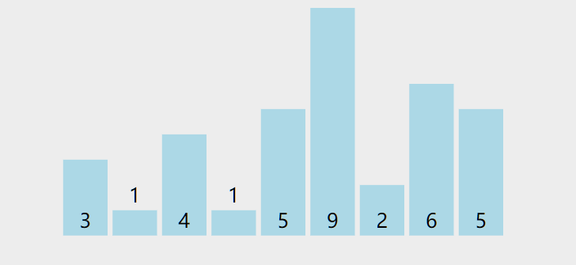
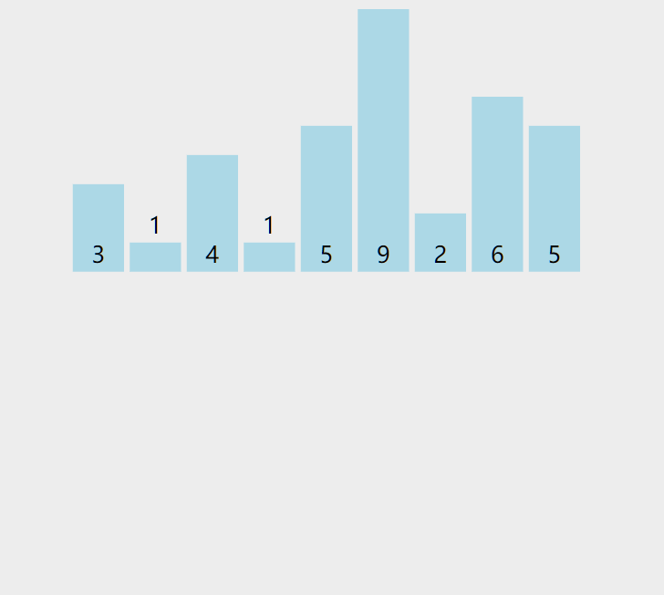
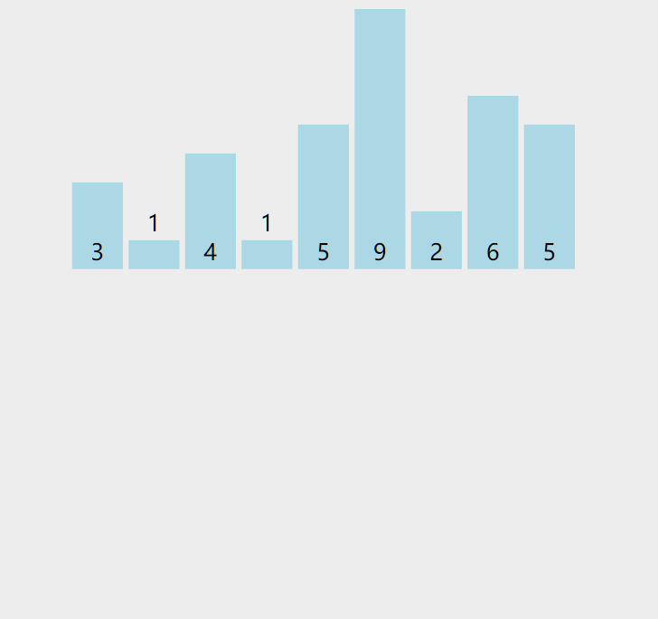
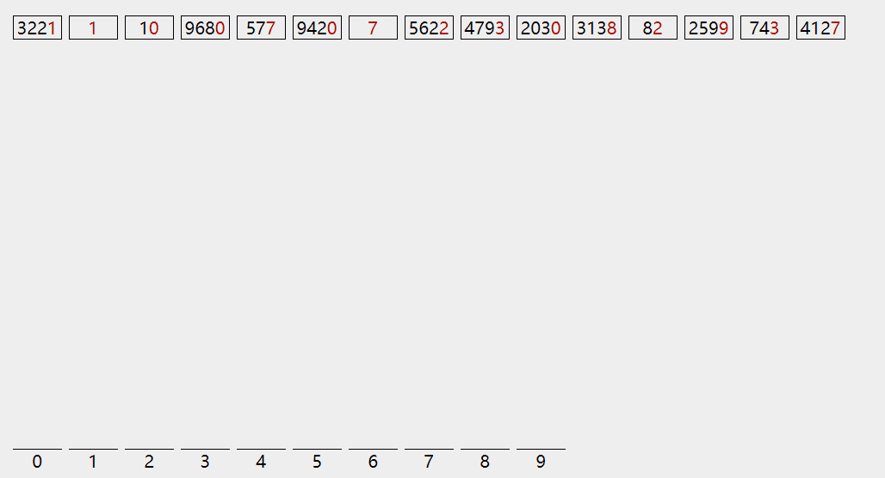

## 前言

本文为对几种排序算法做的一些总结，代码由JavaScript实现，均通过 [leetcode 912.排序数组](https://leetcode-cn.com/problems/sort-an-array/) 的测试用例。

> 动态图均来自对 [排序算法可视化网站](https://visualgo.net/en/sorting) 的截图


全文分为三部分，依次介绍了时间复杂度为 `O(n^2)`，`O(logn)`，`O(n)` 的排序算法。


# O(n^2)


| 排序算法 | 时间复杂度（平均） | 是否稳定 |
| -------- | ------------------ | -------- |
| 冒泡     | O(n^2)             | 稳定     |
| 选择     | O(n^2)             | 不稳定   |
| 插入     | O(n^2)             | 稳定     |


---
## 1.冒泡排序

### 描述

冒泡排序的思想是这样的： 遍历数组，两两比较 **相邻** 元素，如果它俩的相对顺序不符合需要，就交换过来。 


直观的看，该算法在排序中将数组分为两部分：未排序段和已排序段。

每轮内层循环都将当前未排序段的 **最大值** “上浮” 到它应有的位置（图中黄色部分），该位置及其之后的部分都已经完成排序。

示例未排序数组 ： `[3,1,4,1,5,9,2,6,5]`


### 代码实现

实现中需要注意的点是：如果一轮冒泡没有产生交换的话，说明整个数组已经有序了，可以提前终止。

```js
let sortArray = function(nums) {
  //外层倒序遍历, 优先排大的数据(数组右边)
  for (let i = nums.length - 1; i > 0; i--) {
    let hasSwap = false;  //优化: 当一轮冒泡没有执行交换，说明整个数组已经是有序的了，可以提前终止
    for (let j = 0; j < i; j++) {
      if (nums[j] > nums[j + 1]) {
        [nums[j], nums[j+1]] = [nums[j+1], nums[j]]; //交换相邻元素
        hasSwap = true;
      }
    }
    if (!hasSwap) break; //已经有序，提前终止
  }
  return nums;
};
```

### 稳定性

当数组中存在相等元素时，由于判断条件 `if (nums[j] > nums[j + 1])` 为 `false`，不会发生交换，所以相等元素仍然会维持它们原有顺序，该算法是 **稳定** 的


---
## 2.选择排序

### 描述

同冒泡排序一样，选择排序算法也是将数组分为已排序和未排序两段。

每次从未排序段中 **选择** 出最小值，添加到已排序部分的末尾。

与冒泡排序的相邻元素两两交换不同，选择排序每次交换都意味着一个元素找到它应有的位置，故该算法最多只要进行 n-1 次交换。


### 代码实现


```js
let sortArray = function(nums) {
  for (let i = 0; i < nums.length; i++) {
    //遍历未排序部分,找到最小值的下标
    let minIndex = i;
    for (let j = i; j < nums.length; j++) {
      if (nums[j] < nums[minIndex]) {
        minIndex = j;
      }
    }
    //交换元素
    if (minIndex !== i) {
      [nums[i], nums[minIndex]] = [nums[minIndex], nums[i]];//交换
    }
  }
  return nums;
};
```

### 稳定性

选择排序是 **不稳定** 的，这也是实际代码中小范围排序往往选择插入排序而不是选择排序的原因，问题出在交换这里。

例如数组 [2,2,1] ，先选择出最小值1和第一个2交换，就导致两个2的顺序被调换了。


---
## 3.插入排序 

### 描述

插入排序类似于摸扑克牌，手上的牌是已经排序的，摸到新牌会将它 **插入** 到它该呆的位置。

放到代码里，就是一个维护有序数组，并不断添加元素的过程。维护过程中伴随着将有序数组待插入位置后的部分全部向右挪一位。


### 代码实现

```js
let sortArray = function(nums) {
  if (nums.length <= 1) return nums;
  for (let i = 1; i < nums.length; i++) {
    const tmp = nums[i];
    let j = i - 1;
    // 若nums[i]前(已排序部分)有大于nums[i]的值的，向后移位，腾出空间，直到一个<=nums[i]的值
    for (j; j >= 0; j--) {
      if (nums[j] <= tmp) break; // 碰到小的，停下来
      nums[j + 1] = nums[j]; // 挪位子
    }
    nums[j + 1] = tmp;
  }
  return nums;
};
```

### 稳定性

对原始数组的两个相等的元素来说，原本排在前面的元素也会先被插入排序数组中，仍然排在前面，相对顺序保持不变，所以该排序算法是 **稳定** 的。 


---
# O(logn)


## 快速排序

### 描述

快速排序采用的是 **分治** 的思想，方式如下：

在每一轮中，先挑选出一个基准元素，将比它小的元素放一边，比它大的放另一边。

然后递归的对两边执行同样的步骤。递归的终止条件就是到只剩下0到1个元素，分无可分为止。




注释：
- 黄色：基准元素
- 绿色：比基准元素小的
- 紫色：比基准元素大的

(感觉示例数组没选好，这图没有直观的体现出来快排的执行方式。。。)

### 代码实现
这是对快速排序的一种通用的实现，采用的是原地交换的方式。

```js
/**
 * @param {number[]} nums
 * @return {number[]}
 */
var sortArray = function(nums) {
  quickSort(nums, 0, nums.length - 1);
  return nums;
};

function quickSort(arr, left, right) {
  if (left >= right) return;
  // 选取基准元素，将数据分到基准元素两侧，并返回基准元素位置
  let pivotIndex = partition(arr, left, right);
  // 对左右两部分递归执行
  quickSort(arr, left, pivotIndex - 1);
  quickSort(arr, pivotIndex + 1, right);
}

function partition(arr, left, right) {
  let pivot = left; //选择基准元素
  let leftIndex = left;

  for (let i = left; i <= right; i++) {
    if (arr[i] < arr[pivot]) { //比基准元素小的放左边leftIndex位置
      leftIndex++;
      swap(arr, leftIndex, i);
    }
  }
  swap(arr, leftIndex, pivot); //基准元素放中间，隔开两部分
  return leftIndex;
}

function swap(arr, i, j) {
  [arr[i], arr[j]] = [arr[j], arr[i]];
}
```

### 简化实现

上面那种是正常实现方式，但代码比较长，理解起来难度比较大。

这里再给出一种依赖js语法糖的简洁写法，只需要一个函数，并且能更直观的体现出快速排序的执行方式。

当然，简化的写法也有它的缺点，由于没有采用交换的方式，该方法是非原地执行的，多了很多复制数组的开销。


```js
function sortArray(nums) {
  if (nums.length <= 1) return nums; //递归终止条件
  let pivot = 0; // 选择基准元素，这里简单的取开头
  // let pivot = Math.floor(Math.random()*nums.length);//随机选取
  let pivotNum = nums[pivot];

  let left = [],
    right = [];
  for (let i = 0; i < nums.length; i++) {
    if (i === pivot) continue; // 跳过被选中的基准元素
    if (nums[i] <= pivotNum) { //小的放左边，大的放右边
      left.push(nums[i]);
    } else {
      right.push(nums[i]);
    }
  }
  return [ ...sortArray(left), pivotNum, ...sortArray(right) ];
}
```


### 稳定性
快速排序是 **不稳定** 的，设想有三个相等元素ABC，选则基准元素时选到B，那么AC肯定排在B的同一侧，相对顺序发生变化。


### 最坏情况

快速排序中有一个要点就是基准元素如何选取。在上面的示例中，都是直接选了开头第一个元素，大多数情况下，这么选没有问题，但碰到极端情况，将使得复杂度退化到 `O(n^2)`。

对于一个逆序的待排序数组，开头元素是最大的，导致每一轮中 `right` 数组总是空的，也就是说一轮只能排好基准元素它自己的位置，导致要执行N轮才能全部排完。

为了避免这种情况，基准元素应当在可选范围内随机选取。


---
## 归并排序

### 描述

同 [快速排序](#快速排序) 一样，归并排序也是分治法在排序中的应用。

它的方式是这样的：将待排序数组分成两半，假设这两部分都已经是有序的，采用双指针的方式将这两个有序数组拼成更大的有序数组。

可是现在这两部分还没不是有序的呀？那就递归，再拆成两半，直到拆的只剩一个元素，再一层层的拼回去。

关键点在于两个子数组的排序是递归函数做的事，只需要抓住递归函数 **返回已排序数组** 这个定义，在两部分均已经排序的前提下合并成更大的数组就行。

快速排序和归并排序的区别有点类似于二叉树的先序遍历和后序遍历。

- 快速排序：先按照基准元素将数据分到两边，然后再递归执行。（先序）
- 归并排序：先执行递归，在左右两半已经有序的基础上拼出更大的数组。（后序）



### 代码实现

```js
/**
 * @param {number[]} nums
 * @return {number[]}
 */
let sortArray = function(nums) {
  return mergeSort(nums, 0, nums.length - 1);
};

function mergeSort(nums, left, right) {
  if (left === right) return [ nums[left] ];
  let mid = left + Math.floor((right - left) / 2);
  let leftArr = mergeSort(nums, left, mid);
  let rightArr = mergeSort(nums, mid + 1, right);

  let res = [];
  // 两个排序数组生成新的排序数组
  while (leftArr.length && rightArr.length) {
    //选出较小值
    let cur = (leftArr[0] <= rightArr[0]) ? leftArr.shift() : rightArr.shift();
    res.push(cur);
  }
  // leftArr 或 rightArr 可能还有剩的，也要加上，剩的部分比res大
  return [ ...res, ...leftArr, ...rightArr ];
}

```

### 稳定性

该算法是否稳定主要看合并的步骤，通过判断条件 `leftArr[0] <= rightArr[0]` ，相等的元素原本在左边的合并后仍然在左边，该算法是 **稳定** 的。

### 最坏情况

与快速排序选了个不好的基准元素会导致两边不均衡不同，对归并排序来说，原数组的排列顺序对执行没有区别，各种情况下时间复杂度都是 `O(n*logn)`


---
# O(n)


| 排序算法 | 时间复杂度（平均） | 是否稳定 |
| -------- | ------------------ | -------- |
| 计数     | O(n+k)             | 稳定     |
| 基数     | O(n*k)             | 不稳定   |

> k 为桶的个数，计数排序中是数组的值范围，基数排序中是最长数字的长度

## 计数排序

### 描述
在了解计数排序之前，不得不先说明桶排序是如何执行的。

桶排序：

1. 将数组按最大值和最小值分割为若干个有序的区间，称为“桶”。
2. 将数组元素分配到各个桶里，每个桶内部分别排序
3. 按桶的范围大小依次将数据取出，拼到一起就完成了整个数组排序

计数排序可以看做是一种特殊的桶排序，每个桶只放一种数据，看起来就是在记录每个数字出现了多少次。也就是 **计数**。




计数排序虽然时间复杂度很棒，是 `O(n)`。但它不是通用的排序算法，对待排序数组有很多苛刻的要求。

1. 数据范围小：需要根据最大值和最小值的范围申请用于计数的数组，比较适用于年龄、分数之类范围固定的场景。
2. 只能整数：其实还是数据范围的问题，小数有无限的可能性，没办法进行计数。


### 代码实现

实现中需要将最小值映射到计数数组的下标为0的位置，这么做是为了防止出现 `[10001,10002,10003]` 这种范围小但偏离初始下标很远的情况。

```js
let sortArray = function(nums) {
  let arr = [];
  let max = Math.max(...nums);
  let min = Math.min(...nums);

  // 计数
  for (let i = 0; i < nums.length; i++) {
    let index = nums[i] - min;
    arr[index] = arr[index] ? arr[index] + 1 : 1;
  }
  let index = 0;
  for (let i = min; i <= max; i++) {
    let count = arr[i - min]; //出现次数
    while (count > 0) {
      nums[index++] = i;
      count--;
    }
  }
  return nums;
};
```

### 稳定性

当前的代码因为每个数字只用来计数了，先后出现的相等值在这样的+1计数过程中丢失了顺序的信息。

但计数排序仍然有能够实现稳定性的写法，（本来想自己写的，发现写的很不清楚，删了），具体可以参考这篇 [什么是计数排序？](https://www.cnblogs.com/kyoner/p/10604781.html) 的中间部分。

这里只说一下我对这种方式的理解：

通过对计数数组计算 **前缀和**，标记出每个元素在整个序列中的 “排名”。对于在原数组中先后出现的几个相等值ABC，比方说它们占据的是345名。倒序遍历原数组，最后出现的C先去“领走”了345之中的第5名，接下来访问到B再去领第4名。

这样就实现了在值相等时按出现次序排列的特性，保持了排序算法的稳定性。


---
## 基数排序

### 描述

与计数排序一样，基数排序也用到了 **桶** 的概念，它是根据数字的每一“位”来分配桶；

之前每种排序算法不都说明了稳定性嘛，不知道稳定性是用来做什么的？

这里就派上用场了：基数排序由低位到高位，每一轮借助桶来完成一个位置的排序



### 代码实现

```js
let sortArray = function(nums) {
  let max = Math.max(...nums);
  let min = Math.min(...nums);
  let absMax = Math.max(max, -min);// 绝对值最大
  let len = (absMax + '').length; // 位数最多的数字长度

  let buckets = new Array(19).fill(0).map(() => { return []; }); // -9 ~ 9

  for (let i = 0, mod = 1; i < len; i++, mod *= 10) { // 对每一位进行一轮排序
    for (let num of nums) { // 扫描数组将值放入对应的桶
      let bucketIndex = parseInt(num / mod) % 10;
      buckets[bucketIndex + 9].push(num); // -9 ~ 9 映射到 0 ~ 18
    }
    let index = 0;
    for (let bucket of buckets) { // 将桶内元素按序放回到数组
      while (bucket.length) {
        nums[index++] = bucket.shift(); // 每个桶是一个队列
      }
    }
  }

  return nums;
};
```

### 稳定性


---

# 其他

## 稳定性的作用

每种排序算法都专门说明了稳定性，那么稳定性有什么用？

上面的例子中，数组元素都是基本的数字类型，这时稳定性其实没什么意义可言。

但在现实中，待排序的数组元素可能是拥有多个属性的对象，例如：

```js
{
  name : '张三',
  age : 10
}
```

如果需要先按年龄后按名字排序，使用稳定排序算法只需要按两种属性各排一遍就行，但非稳定排序却需要编写自定义比较函数，将两属性拉一块比较。


## 参考

- [《算法（第4版）》](https://book.douban.com/subject/19952400/)
- [leetcode 912.排序数组 的题解](https://leetcode-cn.com/problems/sort-an-array/solution/)

