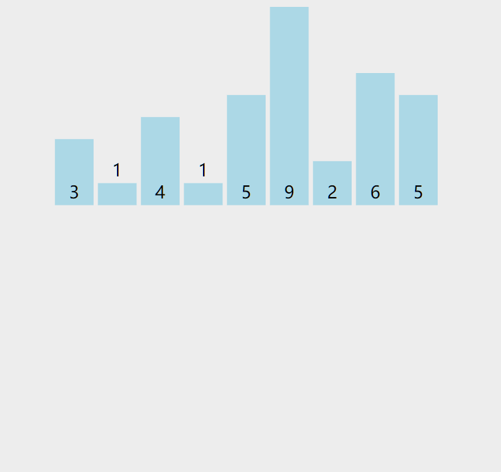
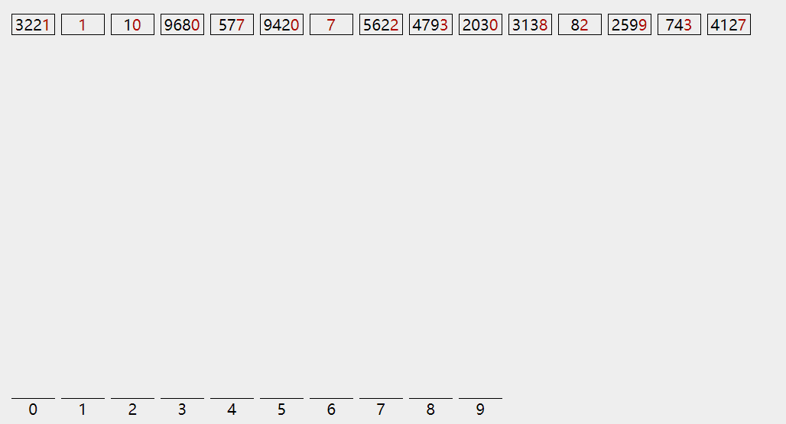

| 排序算法 | 时间复杂度（平均） | 是否稳定 |
| -------- | ------------------ | -------- |
| 计数     | O(n+k)             | 稳定     |
| 基数     | O(n*k)             | 不稳定   |

> k 为桶的个数，计数排序中是数组的值范围，基数排序中是最长数字的长度

## 计数排序

### 描述
在了解计数排序之前，不得不先说明桶排序是如何执行的。

桶排序：

1. 将数组按最大值和最小值分割为若干个有序的区间，称为“桶”。
2. 将数组元素分配到各个桶里，每个桶内部分别排序
3. 按桶的范围大小依次将数据取出，拼到一起就完成了整个数组排序

计数排序可以看做是一种特殊的桶排序，每个桶只放一种数据，看起来就是在记录每个数字出现了多少次。也就是 **计数**。




计数排序虽然时间复杂度很棒，是 `O(n)`。但它不是通用的排序算法，对待排序数组有很多苛刻的要求。

1. 数据范围小：需要根据最大值和最小值的范围申请用于计数的数组，比较适用于年龄、分数之类范围固定的场景。
2. 只能整数：其实还是数据范围的问题，小数有无限的可能性，没办法进行计数。


### 代码实现

实现中需要将最小值映射到计数数组的下标为0的位置，这么做是为了防止出现 `[10001,10002,10003]` 这种范围小但偏离初始下标很远的情况。

```js
let sortArray = function(nums) {
  let arr = [];
  let max = Math.max(...nums);
  let min = Math.min(...nums);

  // 计数
  for (let i = 0; i < nums.length; i++) {
    let index = nums[i] - min;
    arr[index] = arr[index] ? arr[index] + 1 : 1;
  }
  let index = 0;
  for (let i = min; i <= max; i++) {
    let count = arr[i - min]; //出现次数
    while (count > 0) {
      nums[index++] = i;
      count--;
    }
  }
  return nums;
};
```

### 稳定性

当前的代码因为每个数字只用来计数了，先后出现的相等值在这样的+1计数过程中丢失了顺序的信息。

但计数排序仍然有能够实现稳定性的写法，（本来想自己写的，发现写的很不清楚，删了），具体可以参考这篇 [什么是计数排序？](https://www.cnblogs.com/kyoner/p/10604781.html) 的中间部分。

这里只说一下我对这种方式的理解：

通过对计数数组计算 **前缀和**，标记出每个元素在整个序列中的 “排名”。对于在原数组中先后出现的几个相等值ABC，比方说它们占据的是345名。倒序遍历原数组，最后出现的C先去“领走”了345之中的第5名，接下来访问到B再去领第4名。

这样就实现了在值相等时按出现次序排列的特性，保持了排序算法的稳定性。


---
## 基数排序

### 描述

与计数排序一样，基数排序也用到了 **桶** 的概念，它是根据数字的每一“位”来分配桶；

之前每种排序算法不都说明了稳定性嘛，不知道稳定性是用来做什么的？

这里就派上用场了：基数排序由低位到高位，每一轮借助桶来完成一个位置的排序



### 代码实现

```js
let sortArray = function(nums) {
  let max = Math.max(...nums);
  let min = Math.min(...nums);
  let absMax = Math.max(max, -min);// 绝对值最大
  let len = (absMax + '').length; // 位数最多的数字长度

  let buckets = new Array(19).fill(0).map(() => { return []; }); // -9 ~ 9

  for (let i = 0, mod = 1; i < len; i++, mod *= 10) { // 对每一位进行一轮排序
    for (let num of nums) { // 扫描数组将值放入对应的桶
      let bucketIndex = parseInt(num / mod) % 10;
      buckets[bucketIndex + 9].push(num); // -9 ~ 9 映射到 0 ~ 18
    }
    let index = 0;
    for (let bucket of buckets) { // 将桶内元素按序放回到数组
      while (bucket.length) {
        nums[index++] = bucket.shift(); // 每个桶是一个队列
      }
    }
  }

  return nums;
};
```

### 稳定性

