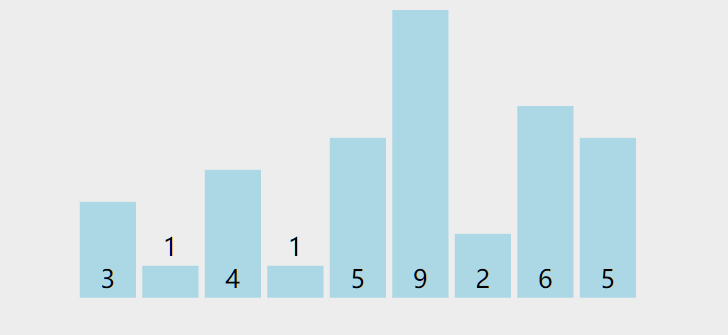
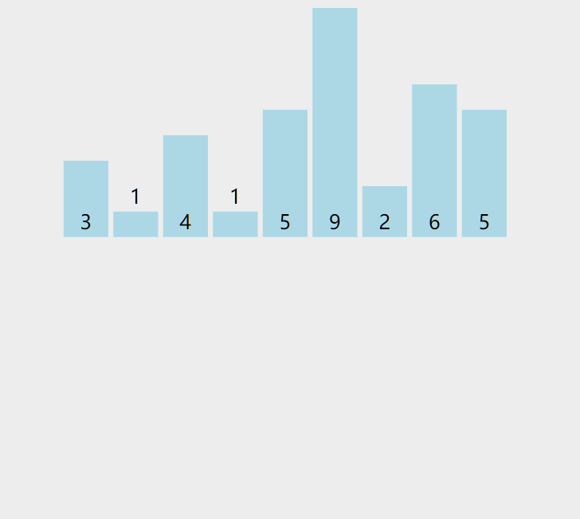

## 快速排序

### 描述

快速排序采用的是 **分治** 的思想，方式如下：

在每一轮中，先挑选出一个基准元素，将比它小的元素放一边，比它大的放另一边。

然后递归的对两边执行同样的步骤。递归的终止条件就是到只剩下0到1个元素，分无可分为止。




注释：
- 黄色：基准元素
- 绿色：比基准元素小的
- 紫色：比基准元素大的

(感觉示例数组没选好，这图没有直观的体现出来快排的执行方式。。。)

### 代码实现
这是对快速排序的一种通用的实现，采用的是原地交换的方式。

```js
/**
 * @param {number[]} nums
 * @return {number[]}
 */
var sortArray = function(nums) {
  quickSort(nums, 0, nums.length - 1);
  return nums;
};

function quickSort(arr, left, right) {
  if (left >= right) return;
  // 选取基准元素，将数据分到基准元素两侧，并返回基准元素位置
  let pivotIndex = partition(arr, left, right);
  // 对左右两部分递归执行
  quickSort(arr, left, pivotIndex - 1);
  quickSort(arr, pivotIndex + 1, right);
}

function partition(arr, left, right) {
  let pivot = left; //选择基准元素
  let leftIndex = left;

  for (let i = left; i <= right; i++) {
    if (arr[i] < arr[pivot]) { //比基准元素小的放左边leftIndex位置
      leftIndex++;
      swap(arr, leftIndex, i);
    }
  }
  swap(arr, leftIndex, pivot); //基准元素放中间，隔开两部分
  return leftIndex;
}

function swap(arr, i, j) {
  [arr[i], arr[j]] = [arr[j], arr[i]];
}
```

### 简化实现

上面那种是正常实现方式，但代码比较长，理解起来难度比较大。

这里再给出一种依赖js语法糖的简洁写法，只需要一个函数，并且能更直观的体现出快速排序的执行方式。

当然，简化的写法也有它的缺点，由于没有采用交换的方式，该方法是非原地执行的，多了很多复制数组的开销。


```js
function sortArray(nums) {
  if (nums.length <= 1) return nums; //递归终止条件
  let pivot = 0; // 选择基准元素，这里简单的取开头
  // let pivot = Math.floor(Math.random()*nums.length);//随机选取
  let pivotNum = nums[pivot];

  let left = [],
    right = [];
  for (let i = 0; i < nums.length; i++) {
    if (i === pivot) continue; // 跳过被选中的基准元素
    if (nums[i] <= pivotNum) { //小的放左边，大的放右边
      left.push(nums[i]);
    } else {
      right.push(nums[i]);
    }
  }
  return [ ...sortArray(left), pivotNum, ...sortArray(right) ];
}
```


### 稳定性
快速排序是 **不稳定** 的，设想有三个相等元素ABC，选则基准元素时选到B，那么AC肯定排在B的同一侧，相对顺序发生变化。


### 最坏情况

快速排序中有一个要点就是基准元素如何选取。在上面的示例中，都是直接选了开头第一个元素，大多数情况下，这么选没有问题，但碰到极端情况，将使得复杂度退化到 `O(n^2)`。

对于一个逆序的待排序数组，开头元素是最大的，导致每一轮中 `right` 数组总是空的，也就是说一轮只能排好基准元素它自己的位置，导致要执行N轮才能全部排完。

为了避免这种情况，基准元素应当在可选范围内随机选取。


---
## 归并排序

### 描述

同 [快速排序](#快速排序) 一样，归并排序也是分治法在排序中的应用。

它的方式是这样的：将待排序数组分成两半，假设这两部分都已经是有序的，采用双指针的方式将这两个有序数组拼成更大的有序数组。

可是现在这两部分还没不是有序的呀？那就递归，再拆成两半，直到拆的只剩一个元素，再一层层的拼回去。

关键点在于两个子数组的排序是递归函数做的事，只需要抓住递归函数 **返回已排序数组** 这个定义，在两部分均已经排序的前提下合并成更大的数组就行。

快速排序和归并排序的区别有点类似于二叉树的先序遍历和后序遍历。

- 快速排序：先按照基准元素将数据分到两边，然后再递归执行。（先序）
- 归并排序：先执行递归，在左右两半已经有序的基础上拼出更大的数组。（后序）



### 代码实现

```js
/**
 * @param {number[]} nums
 * @return {number[]}
 */
let sortArray = function(nums) {
  return mergeSort(nums, 0, nums.length - 1);
};

function mergeSort(nums, left, right) {
  if (left === right) return [ nums[left] ];
  let mid = left + Math.floor((right - left) / 2);
  let leftArr = mergeSort(nums, left, mid);
  let rightArr = mergeSort(nums, mid + 1, right);

  let res = [];
  // 两个排序数组生成新的排序数组
  while (leftArr.length && rightArr.length) {
    //选出较小值
    let cur = (leftArr[0] <= rightArr[0]) ? leftArr.shift() : rightArr.shift();
    res.push(cur);
  }
  // leftArr 或 rightArr 可能还有剩的，也要加上，剩的部分比res大
  return [ ...res, ...leftArr, ...rightArr ];
}

```

### 稳定性

该算法是否稳定主要看合并的步骤，通过判断条件 `leftArr[0] <= rightArr[0]` ，相等的元素原本在左边的合并后仍然在左边，该算法是 **稳定** 的。

### 最坏情况

与快速排序选了个不好的基准元素会导致两边不均衡不同，对归并排序来说，原数组的排列顺序对执行没有区别，各种情况下时间复杂度都是 `O(n*logn)`


