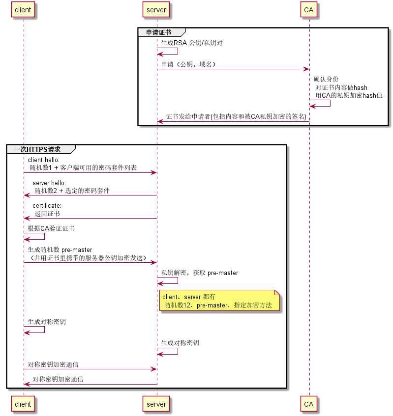
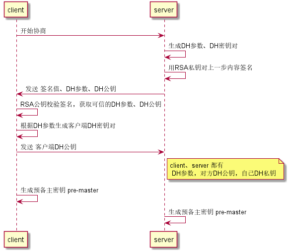
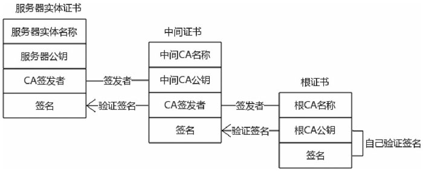
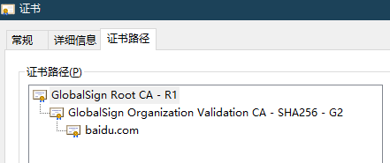
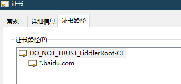

HTTPS实现了客户端与服务端之间的HTTP报文加密传输，要了解它是如何实现的，得先了解加密算法的几种类型和特性


# 加密算法

加密算法主要分为两类，对称和非对称。hash算法单向不可逆，会丢失原始信息，不作考虑。

## 对称加密

使用同一个密钥进行加密解密。

- 问题：无法保证密钥本身传输的安全性

在HTTPS的场景中，客户端和服务端一开始没有联系，只用对称加密没有办法约定好初始的密钥

## 非对称加密

那么用非对称加密会如何？

考虑如下的方式，客户端和服务端各自用对方的公钥加密信息，用自己的私钥解密信息。

```sh
client,server 互发公钥

client -> server  #用server公钥加密信息

client <- server  #用client公钥加密信息
```

这么看起来似乎是可行的？


并不。仅使用非对称加密还是会面临以下问题：

- 问题1：非对称加密效率低

由于非对称加密算法自身的特点，运行效率很低。

如果仅用于加解密小段字符串还好，但考虑到http包括了图片、文件等大数据量的传输，完全用非对称加密的开销是无法承受的。


- 问题2：中间人攻击

仅使用非对称加密无法确定服务器是否是真的，中间人可以伪装成通信方拦截数据。


---
# HTTPS流程

HTTPS简单来说就是 HTTP+TLS（Transport Layer Security Protocol 安全传输层协议），由TLS负责HTTP和TCP之间的加密解密，实现HTTP操作明文数据，TCP传输加密后数据。

HTTPS 综合使用了包括非对称和对称加密在内的多种方法，流程可以不严谨的概括为：

- 客户端：随机生成对称加密的密钥 P
- 客户端：使用服务端非对称加密算法的公钥来加密密钥 P，并传给服务端
- 服务端：使用私钥解出对称算法的密钥 P
- 两边使用对称加密通信


这里是更详细的时序图，下文将详细的解释每个阶段




---
## client hello

客户端生成一个随机数，连同自己能够支持的密码套件列表一起发送给服务端。

其中，密码套件用于指定后续流程中的密钥协商、对称加密、签名等步骤具体使用何种算法。

---
## server hello

服务端也生成一个随机数，并从客户端能够支持的密码套件列表中选出一个，返回给客户端

## certificate

服务端再返回自己的证书，证书中包含服务器的域名、服务端的RSA公钥、证书有效期等信息。

## 客户端验证证书

要确保公钥确实是该网站的，防止中间人攻击。下文详述。

---
## 密钥协商

密钥协商是保证HTTPS安全性的关键一步，它需要实现这样的功能：

令客户端和服务端能够得到相同的变量 `pre-master（预备主密钥）`，并且不能被他人截获该信息。

下面介绍两种密钥协商的方式：RSA 和 DH


## RSA

上面的时序图中展示的密钥协商方式就是RSA，该方式较为简单，流程如下：

- 客户端生成一个随机数作为 `pre-master` 
- 从证书中获取服务端的RSA公钥，加密`pre-master`，传给服务端
- 服务端使用自己的RSA私钥解密，得到 `pre-master`

由于传递时，`pre-master`经过RSA公钥加密，只有掌握着RSA私钥的服务端才能解开获得内容，满足密钥协商的条件。


## DH

DH（Diffie-Hellman）由两个发明者的人名命名。

与RSA方式中`pre-master`完全由客户端生成不同，在DH算法中，`pre-master` 是客户端和服务器端共同计算出来的，只有经过消息互换才能计算出预备主密钥，流程如下：

- 服务端：生成`DH参数`和`DH密钥对`
- 服务端：用自己的`RSA私钥`签名`DH参数`和`DH公钥`，最后将签名值、DH参数、DH公钥全部发送给客户端。
- 客户端：使用服务器RSA的公钥（从证书获取）校验签名，确保获取到的DH参数和DH公钥是由服务端签发的。
- 客户端：通过DH参数生成客户端的DH密钥对，并将客户端DH公钥发送给服务端。
- 客户端：通过客户端DH私钥和服务器端DH公钥计算出预备主密钥。
- 服务端：接收到客户端的DH公钥，结合服务器的DH私钥计算出预备主密钥。
- 最终客户端和服务器端计算出的预备主密钥能够保持一致。



总结一下，双方在协商过程中掌握了以下信息，用于生成 `pre-master`：

- 客户端：DH参数、客户端DH私钥，服务端DH公钥
- 服务端：DH参数、客户端DH公钥，服务端DH私钥


由于私钥自始至终由两端自己保存，没有通过网络传输，所以第三方无法截获，满足条件。


## 两种协商方式区别

- RSA密钥对的作用不同

在RSA方式进行密钥协商时，客户方生成 `pre-master`，用服务端的RSA公钥加密后传递，这里的作用是 **非对称加密** 。

而DH方式则不同，服务端用RSA公钥对DH参数和DH公钥签名，客户端再用RSA公钥解密签名值，验证是否是服务端签发的信息，这里的作用是 **数字签名**。

另一个不同之处就在于是否满足前向安全性。

## 前向安全性

前向安全性指的是，如果有第三方收集了所有通信数据，当时它解不开，但很久之后如果私钥泄漏，能不能回过头来解密这些历史数据。

RSA的方式里，只要知道RSA私钥，就可以直接获取客户端加密传输的 `pre-master`，进而计算出实际的对称加密密钥，该方法是**非前向安全**的。

而在DH算法中，RSA密钥对只是用于做数字签名，用于生成`pre-master`的关键参数 `客户端DH私钥`和 `服务端DH私钥` 都没有经过网络传输，即使RSA私钥泄漏也无法解密历史数据，是 **前向安全**的。


> 注：DH算法其实还分为 静态DH和临时DH（DHE）两种。静态DH中，服务端的DH参数和DH公钥是固定保存在证书里的，也不能保证 前向安全性，该方式已经被OpenSSL废弃。上文描述的其实是 DHE 算法。

---
## 对称加密传输

经过 `client hello`、`server hello` 、`密钥协商`这几步之后，双方都有了以下信息：

- 客户端随机数
- 服务端随机数
- 预备主密钥 `pre-master`
- 使用的密码套件

据此，双方都可以产生相同的对称加密密钥，进行后续的通信。

除此之外，还会生成一个消息认证码密钥（`mac key`）

双方使用对称加密算法进行加密，用`mac key`对HTTP报文做一次运算生成一个消息认证码MAC，附在HTTP报文的后面，然后用对称密钥加密所有数据（HTTP+MAC），最后发送。

接收方则先用对称解密数据，然后得到HTTP+MAC，再用相同的算法计算出自己的MAC，如果两个MAC相等，证明数据没有被篡改。


---
# 证书

如果仅有`client hello`、`server hello` 、`密钥协商`这几个步骤，还不能够保证安全性，因为这样只能保证双方之间数据传递保密，但不能避免中间人攻击。

如果存在一个两头瞒的中间人，对客户端装做服务器，对服务端装作客户端，即使两两之间数据都是加密的，但中间人仍可以获取全部的信息。Fiddler之类的抓包软件起到的就是这样效果。

而证书就是防止中间人 `对客户端装做服务器` 一种机制，核心在于令客户端确认RSA公钥是否真的属于对应的服务器。

为此，引入了一个第三方的权威机构CA（Certificate Authority）来确认RSA公钥和网站的对应关系。

## 证书内容

证书由服务方向CA机构申请，网站申请方需要自己先生成RSA密钥对，并将公钥和申请的域名等信息提交给CA。

CA审核通过后，给申请方返回证书，包括以下内容：

- 内容（部分）
    - 绑定域名
    - 服务的公钥
    - 有效期
    - 颁发机构
- 签名： 内容的hash值用CA的私钥进行加密


## 客户端验证证书

客户端获取服务端返回的证书后，根据证书里的摘要算法生成摘要,记为h1

还会使用CA的公钥解密证书的数字签名，得出 h2 

如果`h1 === h2`，则可以确认证书是由权威的CA机构签发的可信证书，如果再符合以下条件，就可以使用证书里的服务端RSA公钥进行下一步密钥协商了

- 时间未过期
- 域名匹配
- 不在 CRL（证书吊销列表）中


那么问题来了，CA的公钥要从哪里获取？如何保证这个公钥不被伪造可以信任呢？


答案很简单，将CA的公钥写在操作系统和浏览器里，既然微软谷歌之类的机构信任它们，用户就可以认为它们是可信的。

## 证书链

操作系统和浏览器里写入的CA证书称为根证书，但是根CA机构并不直接向网站提供证书签发服务，而是通过一级或多级的中间商来提供。

由根CA签发证书信任中间CA机构，中间CA机构再签发网站的证书，形成了`根CA机构->中间CA->网站提供方`这样的信任传递链条，称为证书链。


证书链里的证书一般分为三层（也有更多层的，存在多级中间证书，但规则是一样的）

- 根证书
- 中间证书
- 服务器实体证书


客户端验证证书时，使用用上一级证书的公钥校验下一级证书的签名，递归执行，直到碰到直接由系统和浏览器所信任的根证书。




## 抓包软件是如何运行的？

知道以上知识后，Fiddler 抓HTTPS包的方式也就清楚了吧。

由于用户的信任，先在操作系统上安装了 Fiddler 的根证书。它再充当一个中间人，拦截浏览器和服务器之间的数据进行展示。

接下来验证一下，不开 Fiddler 访问百度首页，点击地址栏前面的锁图标，查看证书信息



看到一个正常的三级证书链。


打开 Fiddler 再刷新一下，根证书变成 Fiddler 安装的那个了。




# 参考
- [《深入浅出 HTTPS：从原理到实战》](https://book.douban.com/subject/30250772/)
- [SSL/TLS协议详解](https://blog.csdn.net/mrpre/category_9270159.html)
- [Tengine HTTPS原理解析、实践与调试](https://www.toutiao.com/a6561389530765591047/)